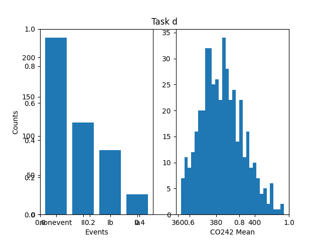
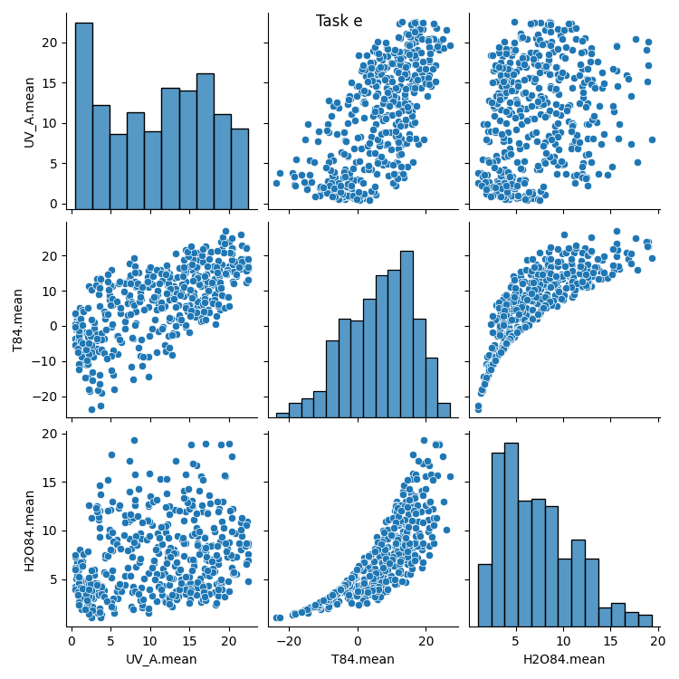
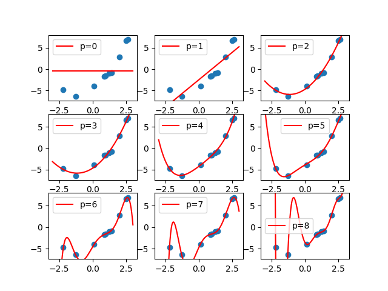
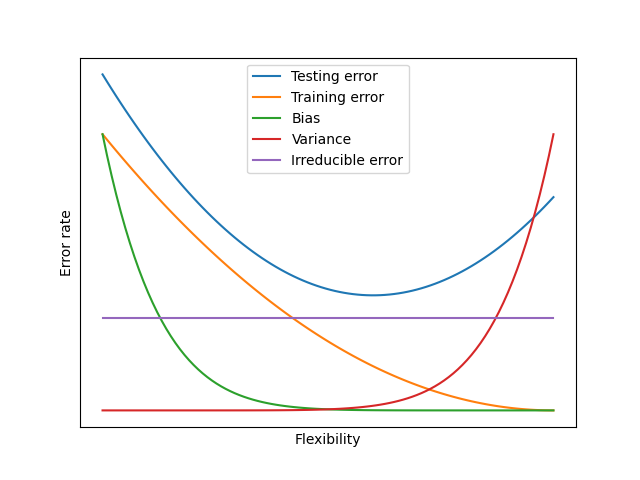
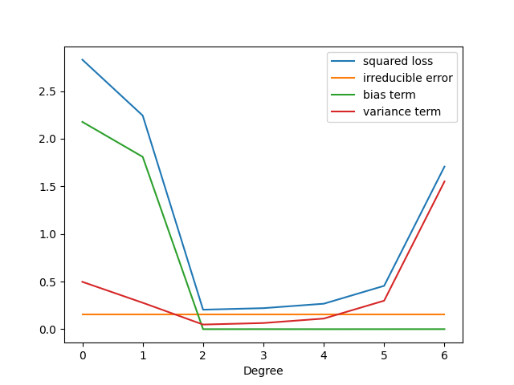
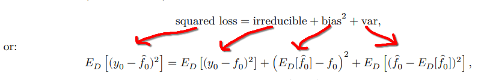
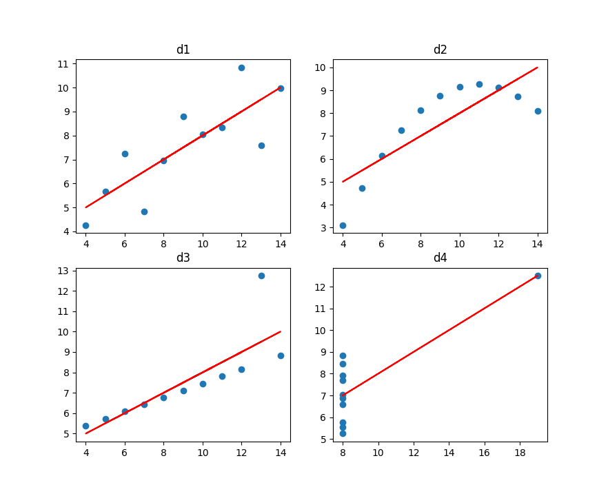
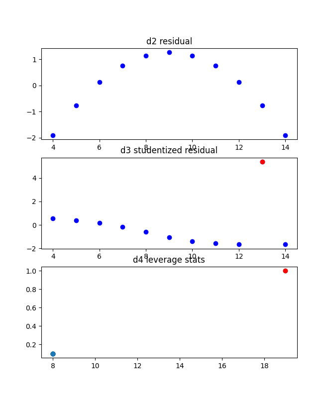

# Problem 1
## Task a
The csv is read with pandas and `.drop()` is called to remove the columns `id` and `partlybad`.
### Code
```python
import pandas as pd

#Task a
df = pd.read_csv("data/train.csv")
df = df.drop(columns=["id", "partlybad"])
```
## Task b
A subsection of the data frame that includes the the columns `T84.mean`, `UV_A.mean` and `CS.mean` is selected and then `.describe()` is called to generate the summary.
### Code
```python
import pandas as pd

#Task b
df = pd.read_csv("data/train.csv")
print(df[["T84.mean","UV_A.mean","CS.mean"]].describe())

```
## Task c
The `T84.mean` column is selected and its values are obtained as Numpy array. `.mean()` is called on the Numpy array to calculate the mean and `.std()` to calculate the standard deviation.
### Code
```python
import pandas as pd

#Task c
df = pd.read_csv("data/train.csv")
t84Arr = df["T84.mean"].values
print("t84 numpy mean:", t84Arr.mean())
print("t84 numpy std:", t84Arr.std())
```
## Task d
To make the charts `matplotlib.pyplot` is used. The two charts are independently created and `pyplot.subplot()` is used to place them next to eachother. After both charts are created `pyplot.show()` is called to display the charts.
### Bar chart
For the bar chart the occurances of events in `class4` column are obtained with `value_counts()`. Then `.index.values` is used to get an array containing the unique events and `.values` to obtain the occurances as an array in the same order as the unique event array. These arrays are the fed to `pyplot.bar()`
### Histogram
For the histogram the values in the `CO242.mean` column are obtained with `.values`, which are then fed to the `pyplot.hist()` function. The `hist()` function also recieves `bins=30` in order to increase the number of bars in the histogram.
### Code
```python
import pandas as pd
import matplotlib.pyplot as plt

#Task d
df = pd.read_csv("data/train.csv")
plt.title('Task d')
plt.subplot(1,2,1)
plt.bar(df["class4"].value_counts().index.values, df["class4"].value_counts().values)
plt.xlabel("Events")
plt.ylabel("Counts")
plt.subplot(1,2,2)
plt.hist(df["CO242.mean"].values, bins=30)
plt.xlabel("CO242 Mean")
plt.show(a)
```
### Plot

## Task e
The `UV_A.mean`, `T84.mean` and `H2O84.mean` columns are selected and fed to `seaborn.pairplot()`. `pyplot.show()` is then called to display the plot.
### Code
```python
import pandas as pd
import matplotlib.pyplot as plt
import seaborn

#Task e
df = pd.read_csv("data/train.csv")
g = seaborn.pairplot(df[["UV_A.mean","T84.mean","H2O84.mean"]])
g.fig.suptitle("Task e")
plt.show()
```
### Plot

## Task f
The number of events that are not `nonevent` are counted and the the total number of evetns are obtained. The probability is then calculated as the not `nonevent` count dividec by the total event count. To get the most common event the number of occurances of each event are calculated with `value_counts()` and then the event with the most occurances is obtained using `.idsmax()`. Then a new data frame if created by making a row for each id in the test data and inserting the most common class and probability on each row. This new data frame is then exported as a .csv file. This dummy model obtained a score of 0.36269.
### Code
```python
import pandas as pd
import matplotlib.pyplot as plt
import seaborn

#Task f
trainDF = pd.read_csv("data/train.csv")
event_count = (trainDF['class4'] != 'nonevent').sum()
total = len(trainDF)
common_class = trainDF['class4'].value_counts().idxmax()
probability = event_count / total

testDF = pd.read_csv("data/test.csv")

dummy = pd.DataFrame({
    'id': testDF['id'],
    'class4': common_class,
    'p': probability
})

dummy.to_csv('models/dummy.csv', index=False)
```

# Problem 2
## Task a
1. First the different datasets (training, testing and validation) are read from files and stored in respective dataframes. The trva dataset is created by combining the training and validation dataframes.
2. The polynomial degrees [0 - 8] are looped through and the `poly()` function is used to create dataframes that include the polynomial features.
3. The OLS model is fitted to the training data and trva data separately and the results are stored in respective variables `model` and `trvamodel`.
4. The `KFold()` function is used to the tenfold cross validation pattern.
5. The `MSE()` function is used to calcutate the mean squared error for the `Train`, `Validation`, `Test` and `TestTRVA` columns in the table.
6. The `cross_validation()` function is used to perform the crossvalidation on the trva dataset and then the mean of the results is calculated.
    - `np.power.outer(H, np.arange((p+1)))` is used to calculate the polynomial features.
    - The `neg_mean_squared_error` scoring option makes sure the cross validation score is the MSE, but it is negated. Therefore the the negated mean of the scores is printed.
### Code
```python
import pandas as pd
import numpy as np
import statsmodels.api as sm
from ISLP.models import (ModelSpec as MS, poly, sklearn_sm)
from sklearn.model_selection import (cross_validate, KFold, ShuffleSplit)

def MSE(model, x, y):
    return ((y - model.predict(x))**2).sum() / len(x)

trainDF =   pd.read_csv("data/train_syn.csv")
testDF =    pd.read_csv("data/test_syn.csv")
validDF =   pd.read_csv("data/valid_syn.csv")
trvaDF =    pd.concat([trainDF, validDF], ignore_index=True)

H = np.array(trvaDF['x'])
M = sklearn_sm(sm.OLS)

print('| Degree\t| Train\t\t\t| Validation\t\t| Test\t\t\t| TestTRVA\t\t| CV\t\t\t|')
print('|---------------|-----------------------|-----------------------|-----------------------|-----------------------|-----------------------|')
for p in range(0, 9):
    if p == 0:
        trainPolyDF = pd.DataFrame({ 'const': np.ones(len(trainDF)) })
        testPolyDF = pd.DataFrame({ 'const': np.ones(len(testDF)) })
        validPolyDF = pd.DataFrame({ 'const': np.ones(len(validDF)) })
        trvaPolyDF = pd.DataFrame({ 'const': np.ones(len(trvaDF)) })
    else:
        trainPolyDF = MS([poly('x', degree=p, raw=True)]).fit_transform(trainDF)
        testPolyDF = MS([poly('x', degree=p, raw=True)]).fit_transform(testDF)
        validPolyDF = MS([poly('x', degree=p, raw=True)]).fit_transform(validDF)
        trvaPolyDF = MS([poly('x', degree=p, raw=True)]).fit_transform(trvaDF)
    
    model = sm.OLS(trainDF['y'], trainPolyDF).fit()
    trvaModel = sm.OLS(trvaDF['y'], trvaPolyDF).fit()
    cv = KFold(n_splits=10, shuffle=True, random_state=0)
   
    X = np.power.outer(H, np.arange((p+1)))
    print(
        f'| {p}\t\t|',
        f'{MSE(model,       trainPolyDF, trainDF['y'])}\t|',
        f'{MSE(model,       validPolyDF, validDF['y'])}\t|',
        f'{MSE(model,       testPolyDF, testDF['y'])}\t|',
        f'{MSE(trvaModel,   testPolyDF, testDF['y'])}\t|',
        f'{-np.mean(cross_validate(
            M,
            X,
            trvaDF['y'],
            cv=cv,
            scoring='neg_mean_squared_error'
        )['test_score'])}\t|'
    )
```

### Output
| Degree        | Train                     | Validation                | Test                      | TestTRVA                  | CV                        |
|---------------|---------------------------|---------------------------|---------------------------|---------------------------|---------------------------|
| 0             | 18.45958471543744         | 32.3423633890777          | 22.100658138803382        | 21.62022122494303         | 29.47972529619117         |
| 1             | 4.08853509977745          | 7.127843632518778         | 8.87630669045679          | 9.934942592846511         | 7.274738817571967         |
| 2             | 0.21858585824966098       | 0.2937318827499832        | **0.24584672986724493**   | **0.21401610603668839**   | **0.3404256220538727**    |
| 3             | 0.21681898850133235       | **0.2834473943397284**    | 0.29007994916779434       | 0.27511057667345545       | 0.3751058882199807        |
| 4             | 0.11879553073504794       | 0.6247258729089251        | 0.9690780194043266        | 0.22399288732056818       | 0.4662675207669075        |
| 5             | 0.09653224688035783       | 0.5734799830959056        | 4.894836220386019         | 1.0390889971463342        | 0.3952163525272134        |
| 6             | 0.007574103844994087      | 3.416787014798486         | 213.29713998109577        | 0.881470788346449         | 0.39025762755317706       |
| 7             | 0.0049993794743657        | 6.862992665537132         | 1261.988069542342         | 0.27171864062603185       | 0.42803527993883517       |
| 8             | **0.0020824670831305877** | 401.65178036684495        | 154266.87136128993        | 11.223554149572486        | 1.7825998446160007        |

By analyzing the various losses for each polynomial degree, the optimal polynomial degree can be selected as the one that minimizes the loss. I have bolded the minimum MSE for each type of loss in the table above. For the test loss the best polynomial degree is p=2. Without the test set the options are the training loss, validation loss and tenfold cross-validation. The training loss is generally unrelated to the test loss, which can also be observed in the results I obtained. While the validation loss comes close to the same answer as the test loss with polynomial degree p=3 instead of p=2 tenfold CV is a better option due to it acutally resulting in p=2. In other words I would use cross-validation if I did not have a test set.

## Task b

1. The polynomial degrees [0 - 8] are looped through.
2. A new dataframe with a 256 long range between -3 and 3 is created.
3. The `poly()` function is used to add the polynomial features.
4. The OLS model is fitted with original values on X including the polynomial features.
5. The model's predict function is called with the previously created range (-3, 3) as the x values.
6. The predicted Y values are mapped out on a plot.
7. The multiple plots generated doring the polynomial loop are mapped out on a scatter plot.
### Code
```python
import numpy as np
import matplotlib.pyplot as plt
import statsmodels.api as sm
import pandas as pd
from ISLP.models import (ModelSpec as MS, poly)

trainDF = pd.read_csv("data/train_syn.csv")

for p in range (0, 9):
    y = trainDF['y']
    new_df = pd.DataFrame({ 'x' : np.linspace(-3, 3, 256) })
    if p == 0 :
        X = sm.add_constant(np.zeros(len(trainDF)))
        new_X = sm.add_constant(np.zeros(len(new_df)))
        
    else :
        X = MS([poly('x', degree=p, raw=True)]).fit_transform(trainDF)
        new_X = MS([poly('x', degree=p, raw=True)]).fit_transform(new_df)

    model = sm.OLS(y, X).fit()
    Y = model.predict(new_X)
    
    plt.subplot(3,3,p+1)
    plt.ylim(trainDF['y'].min() - 1, trainDF['y'].max() + 1)
    plt.scatter(trainDF['x'], trainDF['y'])
    plt.plot(np.linspace(-3, 3, 256), Y, label=f'p={p}', color='red')
    plt.legend()

plt.show()
```

### Output


## Task c
1. Dummy, OLS, Random forest, Support vector and Gradient boosting regressor models are fitted with the training data.
2. The models the have their RMSE calculated on the training data and testing data. 
3. The RMSE on the cross validation of the models are also calculated.

### Code
```python
import numpy as np
import matplotlib.pyplot as plt
import statsmodels.api as sm
import pandas as pd
from math import sqrt
from ISLP.models import (ModelSpec as MS, poly, sklearn_sm)
from sklearn.model_selection import (cross_validate, KFold, ShuffleSplit)
from sklearn.dummy import DummyRegressor as Dummy
from sklearn.ensemble import RandomForestRegressor as RF, GradientBoostingRegressor as GBR
from sklearn.svm import SVR

def RMSE(model, trainX, trainY, testX, testY):
    model.fit(trainX, trainY)
    return sqrt(np.mean((testY - model.predict(testX))**2))

trainDF = pd.read_csv("data/train_real.csv")
testDF = pd.read_csv("data/test_real.csv")
trainX = trainDF.drop(columns=['Next_Tmax'])
trainY = trainDF['Next_Tmax']
testX = testDF.drop(columns=['Next_Tmax'])
testY = testDF['Next_Tmax']

dummyModel = Dummy(strategy='mean')
RFModel = RF(random_state=0)
OLSModel = sklearn_sm(sm.OLS)
SVRModel = SVR()
GBRModel = GBR(random_state=0)
cv = KFold(n_splits=10)

print(f'| Regressor\t| Train\t\t\t| Test\t\t\t| CV\t\t\t|')
print('|---------------|-----------------------|-----------------------|-----------------------|')
print(
    '| Dummy\t\t|',
    f'{RMSE(dummyModel, trainX, trainY, trainX, trainY)}\t|',
    f'{RMSE(dummyModel, trainX, trainY, testX, testY)}\t|',
    f'{sqrt(-np.mean(cross_validate(dummyModel, trainX, trainY, cv=cv, scoring='neg_mean_squared_error')['test_score']))}\t|'
)
print(
    '| OLS\t\t|',
    f'{RMSE(OLSModel, trainX, trainY, trainX, trainY)}\t|',
    f'{RMSE(OLSModel, trainX, trainY, testX, testY)}\t|',
    f'{sqrt(-np.mean(cross_validate(OLSModel, trainX, trainY, cv=cv, scoring='neg_mean_squared_error')['test_score']))}\t|'
)
print(
    '| RF\t\t|',
    f'{RMSE(RFModel, trainX, trainY, trainX, trainY)}\t|',
    f'{RMSE(RFModel, trainX, trainY, testX, testY)}\t|',
    f'{sqrt(-np.mean(cross_validate(RFModel, trainX, trainY, cv=cv, scoring='neg_mean_squared_error')['test_score']))}\t|'
)
print(
    '| SVR\t\t|',
    f'{RMSE(SVRModel, trainX, trainY, trainX, trainY)}\t|',
    f'{RMSE(SVRModel, trainX, trainY, testX, testY)}\t|',
    f'{sqrt(-np.mean(cross_validate(SVRModel, trainX, trainY, cv=cv, scoring='neg_mean_squared_error')['test_score']))}\t|'
)
print(
    '| GBR\t\t|',
    f'{RMSE(GBRModel, trainX, trainY, trainX, trainY)}\t|',
    f'{RMSE(GBRModel, trainX, trainY, testX, testY)}\t|',
    f'{sqrt(-np.mean(cross_validate(GBRModel, trainX, trainY, cv=cv, scoring='neg_mean_squared_error')['test_score']))}\t|'
)
```
### Output
| Regressor     | Train                 | Test                  | CV                    |
|---------------|-----------------------|-----------------------|-----------------------|
| Dummy         | 3.0892748340023104    | 2.997845593088476     | 3.0968237882237735    |
| OLS           | 1.3840458919468352    | 1.4914717986348354    | 1.453780410226564     |
| RF            | 0.5299892678158692    | 1.4727162917547965    | 1.4307745699445455    |
| SVR           | 3.084322984594548     | 2.9973456944213024    | 3.097713085741981     |
| GBR           | 0.6962060835244215    | 1.417682590528309     | 1.4071721730995301    |

### Questions
#### Which regressor is the best? Why?
- The best one is the one with the lowest test error, which in this case it is The random forest regressor. 

#### How does Train compare to Test? How does CV compare to Test?
- The training loss is pretty close to the testing loss, except for the RF and GBR where the models have overfitted to the training data. The overfitting is visible as trainingloss being much lower than the testing loss.
- For all the models the cross validation is pretty close to the testing loss, but the testing loss is still a better metric for how good the models are.
#### How can you improve the performance of these regressors (on this training set)?
- For RF and GBR the hyperparameters can be adjusted to reduce overfitting. This does require some trial and error for example by limiting the max depth on the reandom forest regressor to 5 I was able to bring its training loss closer to the testing loss, but at the same time the testing loss increased slightly. The goal is to bring the training loss closer to the testing loss without while keeping the testing loss low.

# Problem 3

## Task a
### Traing error and test error
- In the plot below we see that when flexibility increases training error decreases. The more flexibile the model the better it fits the training data. But while the testing error initially decreses with the flexibility it start going up after a while. This is because the model start fitting to the noise in the training data. 
- Bias goes down with the increase in flexibility. An inflexible model cannot fit the true function very well, which means the predicted values are far off from the true values. More flexible models are closer to the true function and produce values closer to the true values. 
- Variance goes up with the increase in flexibility. The more flexible a model is the more the model will change depending on the dataset. This is because the model can fit the datasets better when they are more flexible.
- As the name suggests the irreducible error stays constant. This is because it measures the noise in the data, which is something that cannot be reduced. 

#### Code for the plot
```python
import matplotlib.pyplot as plt
import numpy as np

def testError(x):
    return 1/4 + ((x * 2 - 1.2) ** 2)/3

def trainError(x):
    return 0.6 * (1 - x) ** 2

x = np.linspace(0, 100, 100)

plt.plot(x, testError(x/100), label='Testing error')
plt.plot(x, trainError(x/100), label='Training error')

plt.xlabel('Flexibility')
frame1 = plt.gca()
frame1.axes.xaxis.set_ticks([])
frame1.axes.yaxis.set_ticks([])
plt.legend()
plt.show()
```

## Task b
### I
| Degree        | Irreducible           | BiasSq                | Variance              | Total                 | MSE                   |
|---------------|-----------------------|-----------------------|-----------------------|-----------------------|-----------------------|
| 0             | 0.15594178202375228   | 2.1764076878759457    | 0.4971790707847389    | 2.829528540684437     | 2.7927996089467517    |
| 1             | 0.15594178202375228   | 1.809202822939915     | 0.2775877485072016    | 2.2427323534708687    | 2.222510879197839     |
| 2             | 0.15594178202375228   | 3.5104445052129306e-05        | 0.04871824794478795   | 0.20469513441359238   | 0.2066739074406727    |
| 3             | 0.15594178202375228   | 0.00025143047706760577        | 0.06456593948906914   | 0.22075915198988902   | 0.2172436866603704    |
| 4             | 0.15594178202375228   | 4.540883515561021e-05 | 0.11136663907196297   | 0.26735382993087087   | 0.2746233883873589    |
| 5             | 0.15594178202375228   | 0.00016527997843616296        | 0.2989828961923012    | 0.4550899581944896    | 0.4740604678445695    |
| 6             | 0.15594178202375228   | 0.000434459400279319  | 1.5507197764967027    | 1.7070960179207342    | 1.7176801096466052    |

### II


### III
The terms do behave as in task a, but the increase/decrese amount varies from run to run (especially for the bias). Total is really close to the MSE, but not quite. This is becasue the expected irreducible is not constant across the training sets, which affects the calculation of 'total'.

### code
The outer loop creates the 1000 data sets while the inner loop trains the polynomial regression functions. This means I end up with 7000 rows with the pattern: `degree`, `f(0)`, `y0`, `f^(0)`.
In the last loop the terms are calculated for each polynomial degree using the formula provided in the task: 
The terms are then plotted to the graph with the degrees as x.
```python
import numpy as np
import matplotlib.pyplot as plt
import statsmodels.api as sm
from ISLP.models import (ModelSpec as MS, poly)
import pandas as pd
from math import sqrt

N = 10

def f(x):
    return -2 -x + 0.5*x**2


print(f'| Degree\t| Irreducible\t\t| BiasSq\t\t| Variance\t\t| Total\t\t\t| MSE\t\t\t|')
print('|---------------|-----------------------|-----------------------|-----------------------|-----------------------|-----------------------|')

degreesDF = pd.DataFrame({'degree':[], 'f(0)':[], 'y0':[], 'f^(0)':[] })
for iteration in range(0, 1000):
    x = np.random.uniform(-3, 3, size=N)
    epsilon = np.random.normal(0, 0.4, size=N)
    y = f(x) + epsilon
    D = pd.DataFrame({ 'x': x, 'y': y })
    zeroDF = pd.DataFrame({'x': [0, 0], 'y': [f(0) + np.random.normal(0, 0.4), 0]})
    for p in range(0, 7):
        if p == 0:
            trainPolyDF = pd.DataFrame({ 'const': np.ones(len(D)) })
            zeroPolyDF = pd.DataFrame({ 'const': np.ones(len(zeroDF)) })
        else:
            spec = MS([poly('x', degree=p, raw=True)])
            trainPolyDF = spec.fit_transform(D)
            zeroPolyDF = spec.transform(zeroDF)
            
        model = sm.OLS(D['y'], trainPolyDF).fit()

        degreesDF = pd.concat(
            [
                degreesDF,
                pd.DataFrame([[p, f(0), zeroDF['y'][0], model.predict(zeroPolyDF)[0]]], columns=degreesDF.columns)
            ], 
            ignore_index=True
        )

results = pd.DataFrame({'degree': [], 'irreducible error': [], 'bias term': [], 'variance term': [], 'squared loss': []})
for p in range(0, 7):
    df = degreesDF[degreesDF['degree'] == p]
    irreducible = np.mean((df['y0'] - df['f(0)'])**2)
    biasSq = (np.mean(df['f^(0)']) - f(0))**2
    variance = np.mean((df['f^(0)'] - np.mean(df['f^(0)']))**2)
    mse = np.mean((df['y0'] - df['f^(0)'])**2)
    total = irreducible + biasSq + variance

    print(f'| {p}\t\t|', f'{irreducible}\t|', f'{biasSq}\t|', f'{variance}\t|', f'{total}\t|', f'{mse}\t|')
    results = pd.concat(
        [
            results,
            pd.DataFrame([[p, irreducible, biasSq, variance, total]], columns=results.columns)
        ], 
        ignore_index=True
    )

plt.plot(results['degree'], results['squared loss'], label=f'squared loss')
plt.plot(results['degree'], results['irreducible error'], label=f'irreducible error')
plt.plot(results['degree'], results['bias term'], label=f'bias term')
plt.plot(results['degree'], results['variance term'], label=f'variance term')

plt.xlabel('Degree')

plt.legend()
plt.show()
```

# Problem 5
## Task a
Dataset d0:
| coeff         | Term estimate         | Standard error        | P-value               |
|---------------|-----------------------|-----------------------|-----------------------|
| intercept     | 3.000090909090908     | 1.1247467908086437    |0.025734051399162457   |
| Slope         | 0.5000909090909091    | 0.11790550059563408   |0.002169628873078792   |
R-squared: 0.666542459508775


Dataset d1:
| coeff         | Term estimate         | Standard error        | P-value               |
|---------------|-----------------------|-----------------------|-----------------------|
| intercept     | 3.0009090909090905    | 1.125302416245227     |0.025758941030781062   |
| Slope         | 0.5   | 0.1179637459676408    |0.0021788162369108005  |
R-squared: 0.6662420337274844


Dataset d2:
| coeff         | Term estimate         | Standard error        | P-value               |
|---------------|-----------------------|-----------------------|-----------------------|
| intercept     | 3.0024545454545444    | 1.1244812296399933    |0.025619108839500818   |
| Slope         | 0.49972727272727263   | 0.11787766222100227   |0.0021763052792280256  |
R-squared: 0.6663240410665593


Dataset d3:
| coeff         | Term estimate         | Standard error        | P-value               |
|---------------|-----------------------|-----------------------|-----------------------|
| intercept     | 3.001727272727269     | 1.1239210718540587    |0.02559042520075871    |
| Slope         | 0.49990909090909097   | 0.11781894172968554   |0.00216460234719722    |
R-squared: 0.6667072568984652

**The slope term may be positive (or negative) with high confidence. Can you safely conclude that when x
increases (or decreases), y tends to increase (and vice versa)?**
- Although this holds for the linear regressor functions, this may note be true for the true functions of the datasets. If we take a look at the datasets mapped out on a plot:

we can see that not all of the datasets fit well to a linear function. For example d2 definetly curves and would be better fitted to a higher degree polynomial regression. y increases with x until about x=11 and then start decreasing.

The estimated terms, errors and pvalues are extracted through the `.params` parameter on the OLS model.
R-squared is extracted through `.rsquared` parameter on the OLS model.
### Code
```python
import pandas as pd
import numpy as np
import statsmodels.api as sm
import matplotlib.pyplot as plt
from ISLP.models import (ModelSpec as MS, poly, sklearn_sm, summarize)

dfs = [
    pd.read_csv("data/d1.csv"),
    pd.read_csv("data/d2.csv"),
    pd.read_csv("data/d3.csv"),
    pd.read_csv("data/d4.csv")
]

for i, df in enumerate(dfs):
    x = df['x']
    x = sm.add_constant(x)
    results = sm.OLS(df['y'], x).fit()
    print(summarize(results))
    print(f"Dataset d{i}:")
    print(f'| coeff\t\t| Term estimate\t\t| Standard error\t| P-value\t\t|')
    print(f'|---------------|-----------------------|-----------------------|-----------------------|')
    print(f'| intercept\t| {results.params['const']}\t| {results.bse['const']}\t|{results.pvalues['const']}\t|')
    print(f'| Slope\t\t| {results.params['x']}\t| {results.bse['x']}\t|{results.pvalues['x']}\t|')
    print("R-squared:", results.rsquared)
    print('\n')
    plt.subplot(2,2,i+1)
    plt.scatter(df['x'], df['y'])
    plt.plot(df['x'], results.predict(x), color='red')
    plt.title(f'd{i+1}')
plt.show()
```

## Task b
This task uses the same code as the last one to generate the plot.

We can see that the slope is approximately the same for each model eventhough the data differs quite a lot. 

## Task c
Non-linearity, Outliers and high leverage points can be observed. 
- The non-linearity can be detected with residual plots as patterns in the distribution of points. The d2 residual plot below shows a pattern, which indecates that the d2 dataset is not linear. 
- Outliers can also be detected with residual plots, but it is easier with studentized resiudal plots. In the d3 studentized residual the red point has been identified as an outlier, due to it having a studentized residual larger than 3. 
- high leverage points can be detected with the leverage statistic. In the d4 leverage statistic plot the red poitn has been identified as a high leverage point. All the other points have the same leverage statistic, which means thay are stacked in the plot. The red point has a larger leverage statistic than the average and has therefore been identifed as a potential high leverage point.


### code
```python
import pandas as pd
import numpy as np
import statsmodels.api as sm
import matplotlib.pyplot as plt
from ISLP.models import (ModelSpec as MS, poly, sklearn_sm, summarize)

dfs = [
    pd.read_csv("data/d2.csv"),
    pd.read_csv("data/d3.csv"),
    pd.read_csv("data/d4.csv")
]


for i, df in enumerate(dfs):
    
    x = df['x']
    x = sm.add_constant(x)
    results = sm.OLS(df['y'], x).fit()

    plt.subplot(3,1,i+1)
    if i == 0:
        plt.title(f'd2 residual')
        residual = pd.DataFrame({
            'x': df['x'],
            'y': (df['y'] - results.predict(x))
        })
        plt.scatter(residual['x'], residual['y'], color='blue')
    
    elif i == 1:
        plt.title(f'd3 studentized residual')
        studResidual = pd.DataFrame({
            'x': df['x'],
            'y': (df['y'] - results.predict(x))/results.get_prediction(x).summary_frame()['mean_se']
        })
        outliers = studResidual[abs(studResidual['y']) > 3]
        plt.scatter(studResidual['x'], studResidual['y'], color='blue')
        plt.scatter(outliers['x'], outliers['y'], color='red')
    elif i == 2:
        plt.title(f'd4 leverage stats')
        influence = results.get_influence()
        leverage = influence.hat_matrix_diag
        levDF = pd.DataFrame({'x': df['x'], 'y': leverage})
        highLevs = levDF[levDF['y'] > np.mean(leverage)]
        
        plt.scatter(levDF['x'], levDF['y'])
        plt.scatter(highLevs['x'], highLevs['y'], color='red')
    
plt.show()
```