# Problem 8
## Task a
1. The 'species' column in both the training and testing data is replaced with the 'Adelie' column where 1 means Adelie and 0 is notAdelie. 
2. The intercept term is added to both the training X values and testing X values. 
3. `sm.Logit` is used to train a logistin regression model with the training data.
4. The accuracy is carculated by calling `results.predict()` on both data sets.
    - Probabilities over 0.5 are classified as Adelie.
5. A scatter plot is used to best show the distribution of the data.

The red data points are Adelie and the blu are not.

### Output
```bash
Coefficients
const                179.558317
bill_length_mm       -23.201690
bill_depth_mm         38.308170
flipper_length_mm     -0.039799
body_mass_g            0.036815
dtype: float64

Train accuracy: 1.0
Test accuracy: 0.9866666666666667
```

### Plot


### code
```python
import pandas as pd
import numpy as np
import statsmodels.api as sm
import matplotlib.pyplot as plt

trainDF = pd.read_csv('data/penguins_train.csv')
trainDF['Adelie'] = (trainDF['species'] == 'Adelie').astype(int)
trainDF = trainDF.drop(columns = ['species'])

testDF = pd.read_csv('data/penguins_test.csv')
testDF['Adelie'] = (testDF['species'] == 'Adelie').astype(int)
testDF = testDF.drop(columns = ['species'])

trainX = trainDF[['bill_length_mm', 'bill_depth_mm', 'flipper_length_mm', 'body_mass_g']]
trainX = sm.add_constant(trainX)

testX = testDF[['bill_length_mm', 'bill_depth_mm', 'flipper_length_mm', 'body_mass_g']]
testX = sm.add_constant(testX)

results = sm.Logit(trainDF['Adelie'], trainX).fit()

trainAccuracy = ((results.predict(trainX) > 0.5) == trainDF['Adelie']).mean()
testAccuracy = ((results.predict(testX) > 0.5) == testDF['Adelie']).mean()

print('Coefficients')
print(results.params)
print()
print('Train accuracy:', trainAccuracy)
print('Test accuracy:', testAccuracy)

linear_response = np.dot(trainX, results.params)
probs = results.predict(trainX)

col = np.where(trainDF['Adelie']==0,'b','r')

plt.scatter(linear_response, probs, color=col)
plt.show()
```

## Task b

### Output
```bash
Coefficients
const                0.000000
bill_length_mm      -0.084968
bill_depth_mm        0.557587
flipper_length_mm   -0.018480
body_mass_g         -0.000746
dtype: float64

Train accuracy: 0.9333333333333333
Test accuracy: 0.8933333333333333
```

### Plot


- The code works the same as in task a, but `GLM` is used instead of `Logit`.
- The model is fitted with the `fit_regularized` function with the parameters `alpha=0.1` and `L1_wt=1.0`.
- `L1_wt=1.0` makes sure that lasso fit is used instead of ridge fit.
- `alpha=0.1` was tweaked until one coefficient (the intercept) became 0.

### code
```python
import pandas as pd
import numpy as np
import statsmodels.formula.api as smf
import statsmodels.api as sm
import matplotlib.pyplot as plt

trainDF = pd.read_csv('data/penguins_train.csv')
trainDF['Adelie'] = (trainDF['species'] == 'Adelie').astype(int)
trainDF = trainDF.drop(columns = ['species'])
testDF = pd.read_csv('data/penguins_test.csv')
testDF['Adelie'] = (testDF['species'] == 'Adelie').astype(int)
testDF = testDF.drop(columns = ['species'])

trainX = trainDF[['bill_length_mm', 'bill_depth_mm', 'flipper_length_mm', 'body_mass_g']]
trainX = sm.add_constant(trainX)

testX = testDF[['bill_length_mm', 'bill_depth_mm', 'flipper_length_mm', 'body_mass_g']]
testX = sm.add_constant(testX)

model = sm.GLM(trainDF['Adelie'], trainX, family=sm.families.Binomial())
results = model.fit_regularized(alpha=0.1, L1_wt=1.0)

print('Coefficients')
print(results.params)
print()

trainAccuracy = ((results.predict(trainX) > 0.5) == trainDF['Adelie']).mean()
testAccuracy = ((results.predict(testX) > 0.5) == testDF['Adelie']).mean()


print('Train accuracy:', trainAccuracy)
print('Test accuracy:', testAccuracy)

linear_response = np.dot(trainX, results.params)
probs = results.predict(trainX)

col = np.where(trainDF['Adelie']==0,'b','r')

plt.scatter(linear_response, probs, color=col)
plt.show()
```

## Task c
I got the following warnings in task a:
```bash
warnings.warn(msg, category=PerfectSeparationWarning)
... : PerfectSeparationWarning: Perfect separation or prediction detected, parameter may not be identified
Warning: Maximum number of iterations has been exceeded.
         Current function value: 0.000000
         Iterations: 35
ConvergenceWarning: Maximum Likelihood optimization failed to converge. Check mle_retvals
```
The first warning apperares multiple times each time the code is run, which is due to the likelyhood optimization being iterative.

The problem is that there is a a quasi-complete separation in some of the variables between the two classes. For example if we look at the dataset `penguins_train.csv` we see that the `bill_length_mm` variable has only a small overlap between the two species.
| Species   | bill_length_mm range |
|-----------|----------------------|
| Adelie    |        33 - 44       |
| NotAdelie |        43 - 60       |
This means the bill length can predict the species perfectly except for the range 43 - 44. This casues the maximum likelihood estimation to fail for the variable.

<div style="page-break-after: always;"></div>

# Problem 9
$$
\Pr(Y=k|X=x)=\frac{\pi_k f_k(x)}{\sum^2_{l=1}\pi_l f_l(x)}
$$

$$
f_k(x)=\frac{1}{\sqrt{2\pi}\sigma_k}\exp(-\frac{1}{2\sigma^2_k}(x-\mu_k)^2)
$$

If $p_1(x)>p_2(x)$ then class 1 is selected. The denominators for $p_1(x)$ and $p_2(x)$ are the same and cancel out.

$$
\pi_1 f_1(x)>\pi_2 f_2(x)
$$
Logs are monotone which means that the current comparasion 
$\pi_1 f_1(x) > \pi_2 f_2(x)$ is essentially the same as $log{\pi_1} + log{f_1(x)} > log{\pi_2} + log{f_2(x)}$ or in other words $\delta_1(x) > \delta_2(x)$

Plugging in the function $f_1(x)$ and $f_2(x)$ results in

$$
\log{\pi_1} - \log{(\sqrt{2\pi}\sigma_1)} -\frac{1}{2\sigma^2_1}(x-\mu_1)^2 > \log{\pi_2} - \log{(\sqrt{2\pi}\sigma_2)} -\frac{1}{2\sigma^2_2}(x-\mu_2)^2
$$

$\log{(\sqrt{2\pi}\sigma_k)}=\frac{1}{2}\log(2\pi)+\log\sigma_k$ and the $\frac{1}{2}\log(2\pi)$ is a common factor and cancels out. Furthermore $\log\sigma_k$ can be rewritten as $\frac{1}{2}\log{\sigma_k^2}$. Which results in:

$$
\log{\pi_1} - \frac{1}{2}\log{\sigma_1^2} -\frac{1}{2\sigma^2_1}(x-\mu_1)^2 > \log{\pi_2} - \frac{1}{2}\log{\sigma_2^2} -\frac{1}{2\sigma^2_2}(x-\mu_2)^2
$$

This can be turned into the difference between the discriminants
$$
\log{\pi_1} - \log{\pi_2} - (\frac{1}{2}\log{\sigma_1^2} - \frac{1}{2}\log{\sigma_2^2}) - (\frac{1}{2\sigma^2_1}(x-\mu_1)^2 - \frac{1}{2\sigma^2_2}(x-\mu_2)^2)
$$
Which can be rewritten as:
$$
\log{\frac{\pi_1}{\pi_2}} - \frac{1}{2}(\log{\sigma_1^2} - \log{\sigma_2^2})

- \frac{1}{2}(\frac{(x-\mu_1)^2}{\sigma^2_1} - \frac{(x-\mu_2)^2}{\sigma^2_2})
$$
The decision boundary between class 1 and class 2 is when the difference between their discriminants is 0. 
$$
\log{\frac{\pi_1}{\pi_2}} - \frac{1}{2}(\log{\sigma_1^2} - \log{\sigma_2^2}) - \frac{1}{2}(\frac{(x-\mu_1)^2}{\sigma^2_1} - \frac{(x-\mu_2)^2}{\sigma^2_2})=0
$$
By doubling to remove the $\frac{1}{2}$ and then rearranging:
$$
2\log{\frac{\pi_1}{\pi_2}} - \log{\frac{\sigma_1^2}{\sigma_2^2}} = (\frac{(x-\mu_1)^2}{\sigma^2_1} - \frac{(x-\mu_2)^2}{\sigma^2_2})
$$
By expanding the $(x-\mu_k)^2$ lefthand side of the equation becomes:
$$
(\frac{1}{\sigma^2_1} - \frac{1}{\sigma^2_2})x^2+(\frac{2\mu_1}{\sigma^2_1}+\frac{2\mu_2}{\sigma^2_2})x+\frac{\mu^2_1}{\sigma^2_1}-\frac{\mu^2_2}{\sigma^2_2}
$$
And then the equation can be rearranged into:
$$
(\frac{1}{\sigma^2_1} - \frac{1}{\sigma^2_2})x^2+(\frac{2\mu_1}{\sigma^2_1}+\frac{2\mu_2}{\sigma^2_2})x+\frac{\mu^2_1}{\sigma^2_1}-\frac{\mu^2_2}{\sigma^2_2}-2\log{\frac{\pi_1}{\pi_2}} + \log{\frac{\sigma_1^2}{\sigma_2^2}} = 0
$$

We can see that the quadratic coefficient is $\frac{1}{\sigma^2_1} - \frac{1}{\sigma^2_2}$. If we assume that $\sigma_1 \neq \sigma_2$ then the quadratic coefficient is non-zero, which means that the decision boundary equation is quadratic and not linear.

<div style="page-break-after: always;"></div>

# Problem 10
## Task a
### Output
Adelie
   stat  bill_length_mm  bill_depth_mm  flipper_length_mm  body_mass_g
0  mean        38.12400       18.33600         188.880000  3576.000000
1   std         2.72533        1.17979           6.192382   452.022123
prob: 0.33766233766233766

not Adelie
   stat  bill_length_mm  bill_depth_mm  flipper_length_mm  body_mass_g
0  mean       47.818000      15.890000         211.300000  4657.000000
1   std        3.563296       1.945688          11.674331   779.615931
prob: 0.6623376623376623
### Code
```python
import pandas as pd
import numpy as np
import statsmodels.api as sm
import matplotlib.pyplot as plt
from math import ceil, sqrt, pi, exp

trainDF = pd.read_csv('data/penguins_train.csv')
testDF = pd.read_csv('data/penguins_test.csv')

#Task a
def getAttributeStats(df, column, y):
    classDF = df[df[column] == y].drop(columns=[column])
    stats = pd.DataFrame({'stat': ['mean', 'std']})
    for attr in classDF.columns.values:
        stats[attr] = [np.mean(classDF[attr]), np.std(classDF[attr])] 
        
    return stats

def laplaceSmooth(df, column, y):
    classDF = df[df[column] == y].drop(columns=[column])
    return (len(classDF) + 1) / (len(df) + 2)

print('Adelie')
print(getAttributeStats(trainDF, 'species', 'Adelie'))

print('prob:', laplaceSmooth(trainDF, 'species', 'Adelie'))

print()
print('not Adelie')
print(getAttributeStats(trainDF, 'species', 'notAdelie'))

print('prob:', laplaceSmooth(trainDF, 'species', 'notAdelie'))
print()
```

## Task b
The 4 features in data (bill_length_mm, bill_depth_mm, flipper_length_mm, body_mass_g) are quantitative, which means that a normal distribution can be assumed. The density function becomes:
$$
f_k(x_j)=\frac{1}{\sqrt{2\pi}\sigma_{jk}}\exp(-\frac{1}{2\sigma_{jk}^2}(x-\mu_{jk})^2)
$$
where $\sigma_k$, $\sigma_k^2$ and $\mu_k$ are the standard deviation, variance and mean for the jth feature in the kth class.

The formula for the posterior probability is:
$$
\Pr(Y=k|X=x)=\frac{\pi_k \times f_{k1}(x_1) \times f_{k2}(x_2) \times ... \times f_{kp}(x_p) }{\sum_{l=1}^K \pi_l \times f_{l1}(x_1) \times f_{l2}(x_2) \times ... \times f_{lp}(x_p)}
$$

The the density function can be plugged into the posterior probability function, which results in:
$$
\Pr(Y=k|X=x)=\frac{\pi_k \times \prod_{j=1}^p \frac{1}{\sqrt{2\pi}\sigma_{jk}}\exp(-\frac{1}{2\sigma_{jk}^2}(x-\mu_{jk})^2)}{\sum_{l=1}^K \pi_l \times \prod_{j=1}^p \frac{1}{\sqrt{2\pi}\sigma_{jl}}\exp(-\frac{1}{2\sigma_{jl}^2}(x-\mu_{jl})^2)}
$$

## Task c
### Code
The following code continues from the code in task a.
```python
#Task c
def density(x, mean, std):
    return exp(-((x - mean) ** 2) / (2 * std**2)) / (sqrt(2*pi) * std)

def postProb(df, column, y, X):
    numerator = laplaceSmooth(df, column, y)
    for attr in X.columns.values:
        stats = getAttributeStats(df, column, y)
        mean = stats[stats['stat'] == 'mean'][attr].iloc[0]
        std = stats[stats['stat'] == 'std'][attr].iloc[0]
        x = X[attr].iloc[0]

        numerator *= density(x, mean, std)
    
    classes = df[column].unique()
    denominator = 0
    for c in classes:
        product = laplaceSmooth(df, column, c)
        stats = getAttributeStats(df, column, c)
        for attr in X.columns.values:
            mean = stats[stats['stat'] == 'mean'][attr].iloc[0]
            std = stats[stats['stat'] == 'std'][attr].iloc[0]
            x = X[attr].iloc[0]
            product *= density(x, mean, std)
        denominator+=product
    
    return numerator / denominator

X = testDF.drop(columns=['species'])
Y = testDF['species']
preds = []
for i in range(0,len(testDF)):
    prob = postProb(trainDF, 'species', 'Adelie', X.iloc[[i]])

    preds.append('Adelie' if prob >= 0.5 else 'notAdelie')
    if i < 3:
        print(f'p^(y = Adelie | x_{i}) =', prob)
print('Accuracy:', np.mean(testDF['species'].values == np.array(preds)))
```

### Output
p^(y = Adelie | x_0) = 0.9967896646386412
p^(y = Adelie | x_1) = 0.7953470279474658
p^(y = Adelie | x_2) = 0.998919564529168
Accuracy: 0.9333333333333333

<div style="page-break-after: always;"></div>

# Problem 11
## Task a
Discriminative learning is considered to be better for larger datasets while generative ones may be better when the dataset is small. This is because while discriminative learning has generally has a lower asymptotic error, generative learning reaches its asymptotic error earlier. This means that as the dataset increases, generative classifiers reach their final performance before discriminative ones do, which may mean that they are better for smaller sets.

## Task b
Two different parametric families are discussed 'Continuous inputs' and 'Discrete inputs'. The following models are chosen for $h_{Gen}$ and $h_{Dis}$ for the families:
| Family            | $h_{Gen}$                     | $h_{Dis}$           |
|-------------------|-------------------------------|---------------------|
| Continuous inputs | Normal discriminant analysis  | Logistic regression |
| Discrete inputs   | Naive Bayes                   | Logistic regression |

$h_{Gen}$ is fit to optimize the joint likelyhood of the input/features $p(\textnormal{features}, \textnormal{targets})$ and labels/targets. $h_{Dis}$ is fit to either optimize the conditinal likelyhood $p(\textnormal{target} | \textnormal{features})$ or to minimize the training error.

## Task c
For discrete inputs the Naive Bayes performs better most of the time with a few exceptions where the training dataset has grown enough for logistic regression to overtake it. Continuous datasets in comparasion show more scenarios where logistic regression overtakes Naive Bayes as the training dataset grows. 

<div style="page-break-after: always;"></div>

# Problem 12
## Task a
Naive bayes assumes that all fetures are coniditionally independent. In the probability function:
$$p(y=1|x_1,x_2)=\sigma(0.1-2x_1+x_2+0.2x_1x_2)$$
there is an interaction between the features $x_1$ and $x_2$ in the form $0.2x_1x_2$. This means that they conditionally depend on each other and that the Naive Bayes asumption does not hold.

## Task b

### Output
```bash
Accuracy
      n      NB      LR     LRi  OptimalBayes   Dummy
0     8  0.6643  0.7903  0.7921         0.793  0.5214
1    16  0.7635  0.7591  0.7268         0.793  0.5214
2    32  0.7476  0.7898  0.7910         0.793  0.4786
3    64  0.7855  0.7853  0.7884         0.793  0.5214
4   128  0.7889  0.7857  0.7758         0.793  0.4786
5   256  0.7919  0.7880  0.7911         0.793  0.5214
6   512  0.7903  0.7892  0.7918         0.793  0.5214
7  1024  0.7919  0.7913  0.7923         0.793  0.4786
8  2048  0.7888  0.7913  0.7921         0.793  0.5214
9  4096  0.7902  0.7911  0.7940         0.793  0.5214

Perplexity
      n        NB        LR       LRi  OptimalBayes     Dummy
0     8  4.057557  1.579174  1.578610      1.546456  2.065591
1    16  2.694979  2.421934  3.142549      1.546456  2.065591
2    32  2.504328  1.604921  1.604722      1.546456  2.003918
3    64  2.159309  1.569074  1.565916      1.546456  2.000977
4   128  2.496376  1.575208  1.599610      1.546456  2.000000
5   256  2.242306  1.552085  1.549597      1.546456  2.001528
6   512  2.204950  1.554301  1.550855      1.546456  2.003442
7  1024  2.289562  1.550856  1.547556      1.546456  2.000137
8  2048  2.362564  1.551145  1.547809      1.546456  2.000917
9  4096  2.355107  1.550883  1.547207      1.546456  2.000441
```

### Code
1. The values for $n \in \{2^3, 2^4, ..., 2^{12}\}$ are looped through and the respective datasets are loaded as train data.
2. Separate data frames (`trainXi` and `testXi`) are created which include the interaction term $x_1x_2$ for both the training and testing data.
3. The models are fitted with appropriate training data
    - GaussianNB and DummyClassifier from sklearn are used for NaiveBAyes and The Dummy respectively.
    - GLM from statsmodels is used for Logistic regression with and without the interaction term.
    - LRi uses the `trainXi` while the rest use `trainX`
4. Optimal Bayes is defined as a python function that returns the result of the following predictor function with x1 and x2 from provided input dataframe:
$$
p(y=1|x_1,x_2)=\frac{1}{1+e^{-{0.1-2x_1+x_2+0.2x_1x_2}}}
$$ 
5. The accuracy for each model is calculated
    - This is done by taking the mean of the hard predicted $\hat{y}\textnormal{s}$ compared to the actual $y\textnormal{s}$.
    - For Naive Bayes and the dummy simply calling predict is enough but for the rest probabilities over or equal to 0.5 are considered as $\hat{y} = 1$
6. The perplexity is calculated using the formula provided in problem 8.
    - For Naive Bayes and the dummy the probabilities are obtained by calling `.predict_proba` and selecting the probability for the `y` in the test data set by index.
    - For the other models `np.where()` is used to invert the calculated probability like: $1-p(y=1|x)$, when $y=0$ in the test dataset.
7. The accuracy and perplexity are saved in their own dataframes for each $n$. After the loop the dataframes are printed.
```Python
import numpy as np
import pandas as pd
import statsmodels.api as sm
from sklearn.naive_bayes import GaussianNB
from sklearn.dummy import DummyClassifier

testDF = pd.read_csv('data/toy_test.csv')
testX = testDF.drop(columns=['y'])
testY = testDF['y']
testXi = testX.copy()
testXi['x1_x2'] = testDF['x1'] * testDF['x2']

accuracyDF = pd.DataFrame({ 'n':[], 'NB':[], 'LR':[], 'LRi':[], 'OptimalBayes': [], 'Dummy': []})
accuracyDF = accuracyDF.astype({'n': 'int64'})

perplexityDF = pd.DataFrame({ 'n':[], 'NB':[], 'LR':[], 'LRi':[], 'OptimalBayes': [], 'Dummy': []})
perplexityDF = perplexityDF.astype({'n': 'int64'})

def optimal_bayes(df):
    t = 0.1 - 2*df['x1'] + df['x2'] + 0.2*df['x1']*df['x2']
    return 1 / (1 + np.exp(-t))

for i in range(3, 13):
    n = 2**i
    trainDF = pd.read_csv(f'data/toy_train_{n}.csv')
    trainX = trainDF.drop(columns=['y'])
    trainXi = trainX.copy()
    trainXi['x1_x2'] = trainDF['x1'] * trainDF['x2']
    trainY = trainDF['y']

    NB = GaussianNB()
    NB.fit(trainX, trainY)
    LR = sm.GLM(trainY, trainX, family=sm.families.Binomial()).fit()
    LRi = sm.GLM(trainY, trainXi, family=sm.families.Binomial()).fit()
    Dummy = DummyClassifier(strategy='prior').fit(trainX, trainY)

    accuracyDF = pd.concat(
        [
            accuracyDF,
            pd.DataFrame(
                [[
                    n,
                    np.mean(testY.values == np.array(NB.predict(testX))),
                    ((LR.predict(testX) >= 0.5) == testY).mean(),
                    ((LRi.predict(testXi) >= 0.5) == testY).mean(),
                    ((optimal_bayes(testX) >= 0.5) == testY).mean(),
                    np.mean(testY.values == np.array(Dummy.predict(testX))),
                ]],
                columns=accuracyDF.columns)
        ], 
        ignore_index=True
    )

    perplexityDF = pd.concat(
        [
            perplexityDF,
            pd.DataFrame(
                [[
                    n,
                    np.exp(-np.mean(np.log(np.array(NB.predict_proba(testX)[testY])))),
                    np.exp(-np.log(np.where(testY == 1, LR.predict(testX), 1 - LR.predict(testX))).mean()),
                    np.exp(-np.log(np.where(testY == 1, LRi.predict(testXi), 1 - LRi.predict(testXi))).mean()),
                    np.exp(-np.log(np.where(testY == 1, optimal_bayes(testX), 1 - optimal_bayes(testX))).mean()),
                    np.exp(-np.mean(np.log(np.array(Dummy.predict_proba(testX)[testY])))),
                ]],
                columns=perplexityDF.columns)
        ], 
        ignore_index=True
    )

print('Accuracy')
print(accuracyDF)
print()
print('Perplexity')
print(perplexityDF)
    
```

## Task c
By adding the following at the end of the loop in the code for task b:
```python
if n == 4096:
    print('LRi params at n=4096')
    print(LRi.params)
    print()
```
I got the following output:
```bash
LRi params at n=4096
x1      -1.991962
x2       0.931033
x1_x2    0.303160
dtype: float64
```
The coefficients are pretty close:
| Coeff     | LRi       | Actual | Difference     |
|-----------|-----------|--------|----------------|
| Intercept | -         | 0.1    | Does not exist |
| $x_1$     | -1.991962 | -2     | 0.008038       |
| $x_2$     | 0.931033  | 1      | 0.068967       |
| $x_1x_2$  | 0.303160  | 0.2    | 0.103160       |
the exception being that LRi does not have an intercept.

### Which of the models above are probabilistic, discriminative, and generative?
All of the models except the dummy are probabilistic. This is because they model the probaility of a class given the input features. The dummy depends only on the $y$ in the training data and therefore does not calssify as a probabilistic model.
Naive Bayes and the optimal bayes are generative classifiers
Logistic regression is a discriminative classifier

### How do accuracy and perplexity (log-likelihood) compare?
As expected Optimal Bayes performs the best when it comes to both accuraacy and perplexity. 
For accuracy, all models except the dummy converge towards the optimal bayes accuracy as the training data set grows.
When it comes to perplexity, Naive Bayes performs really bad, due to the incorrect assumptions of feature independence. Even the dummy has better complexity with ~2, which corresponds to the perplexity of coin flipping. The difference between the accuracy and perplexity of Naive Bayes comes down to the fact that accuracy hides the errors visible in the probability by hard predicting a class even if the probability is 50%.

### Is there a relation to the insights from the previous problem?
We can see that when $n=16$ Naive Bayes has a higher accuracy than logistic regression does. While Logistic regression performs better at $n=8$ than Naive Bayes it could be due to "luck". If the insights from problem 11 hold true then generative models may perform better at smaller training sets, which could explain why Naive Bayes performs better at $n=16$

### Why does logistic regression with the interaction term perform so well for larger datasets?
The true function is a logistic function with very similar coefficients to what LRi has at $n=4096$. As the training dataset grows, the estimated coefficients converge toward the true functions coefficients. The Logisti Regression without interaction does not have all the coefficients that the true function has, which means it dor not converge as well as LRi does.

### Does your dummy classifier ever outperform other classifiers, or do different classifiers outperform the optimal Bayes classifier?
The dummy model is allwaysa the least accurate one, but it does have better perplexity than NB.

<div style="page-break-after: always;"></div>

# Problem 13
I begin by splitting for x1
To decide the where to split I minimise the Gini Index.
$$
G = \frac{n_x}{n}(1 - \frac{n_x}{n}) + \frac{n_o}{n}(1 - \frac{n_o}{n})
$$
where $n_x$, $n_o$ and $n$ are number of x, number of o and total number of points respectively.

Because I am only dealing with two classes I can simplify the Gini Index to
$$
G = \frac{n_x}{n}\frac{n_o}{n} + \frac{n_o}{n}\frac{n_x}{n}
$$
$$
= 2 \frac{n_x}{n}\frac{n_o}{n}
$$
$$
= 2 \frac{n_x \times n_o}{n^2}
$$


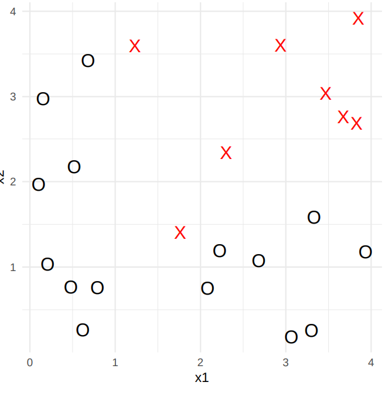

Visually I can see that the left side Gini Index will be minimized at $x_1=1$, because only Os will be on the left. 
I begin moving right from $x_1=1$:
| $x_1=1$                                                              | $x_1=1.5$                                                            | $x_1=2$                                                                |
|----------------------------------------------------------------------|----------------------------------------------------------------------|------------------------------------------------------------------------|
| 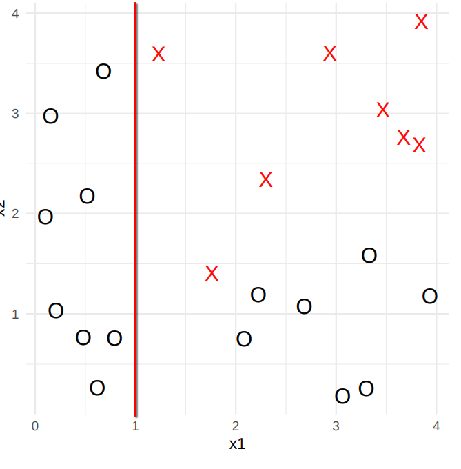                         | 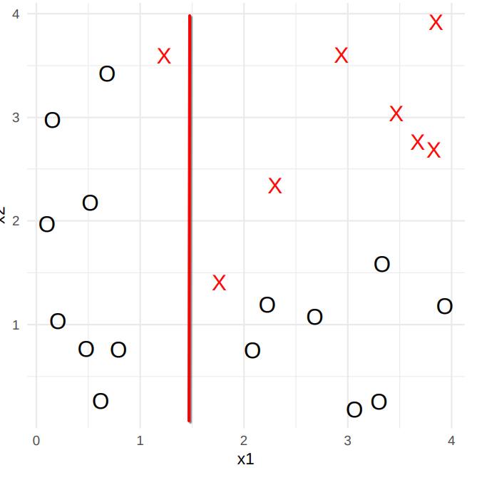                         | 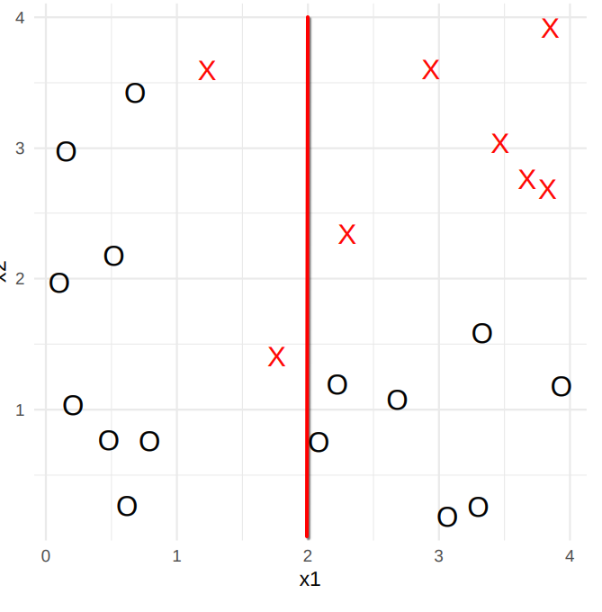                           |
| 0 Xs and 8 Os on the left                                            | 1 X and * Os on the left                                             | 2 Xs and 8 Os on the left                                              |
| 8 Xs and 7 Os on the right                                           | 7 Xs and 7 Os on the right                                           | 6 Xs and 7 Os on the right                                             |
| $G = 2\frac{0 \times 8}{8^2} + 2 \frac{8 \times 7}{15^2} = 04977...$ | $G = 2\frac{1 \times 8}{9^2} + 2\frac{7 \times 7}{14^2} = 0.6975...$ | $G = 2\frac{2 \times 8}{10^2} + 2 \frac{6 \times 7}{13^2} = 0.8170...$ |

I see that the Gini sum is increasing as I move right and conclude that the gini index is minimized at $x_1=1$

Next I start splitting $x_2$ in the right segment. This is because the left already only contains Os so splitting further would be unnecessary. I start at $x_2=2$ and move down because then the top part of the segment is only Xs.


| $x_2=2$                                                             | $x_2=2.5$                                                           | $x_2=2.55$                                                      |
|---------------------------------------------------------------------|---------------------------------------------------------------------|-----------------------------------------------------------------|
| 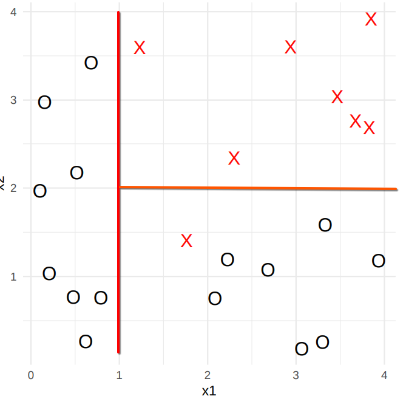                        | 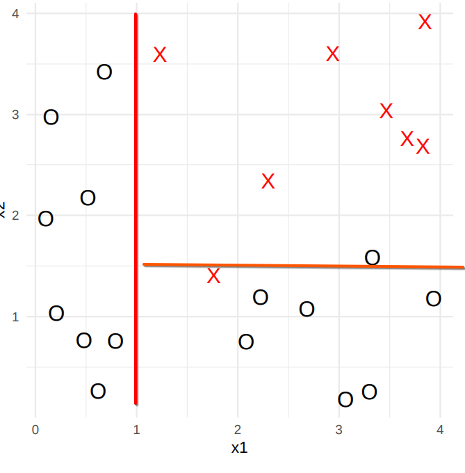                        | 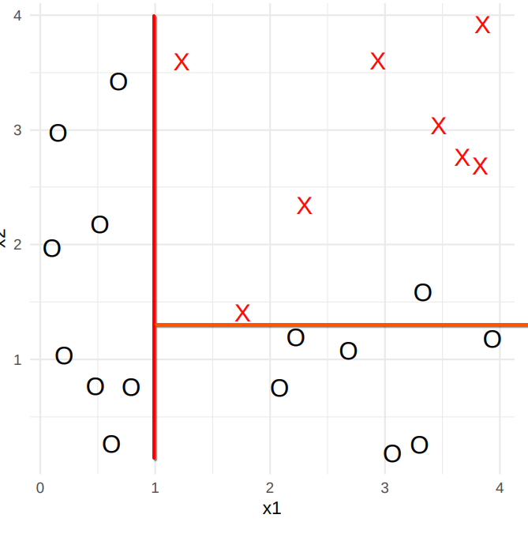                    |
| 7 Xs and 0 Os on top                                                | 7 Xs and 1 Os on top                                                | 8 Xs and 1 Os on top                                            |
| 1 X and 7 Os on bottom                                              | 1 X and 6 Os on bottom                                              | 0 X and 6 Os on bottom                                          |
| $G = 2\frac{7 \times 0}{7^2} + 2\frac{1 \times 7}{8^2} = 0.2187...$ | $G = 2\frac{7 \times 1}{7^2} + 2\frac{1 \times 6}{8^2} = 0.4732...$ | $G = 2\frac{8\times1}{7^2} + 2\frac{0\times6}{8^2} = 0.3265...$ |

There are now only Os on the bottom, which means the Gini Index will not decrease furhter by moving downwards. Therefore the best split is at $x_2=2$. After this the bottom right is the only segment with mixed classes. From the leftmost figure, which represents the chosen split, it is clear that the next split should happen at $x_1=2$ in the bottom right segment. At $x_1=2$ the gini index will be 0 and moving left or right would increase it

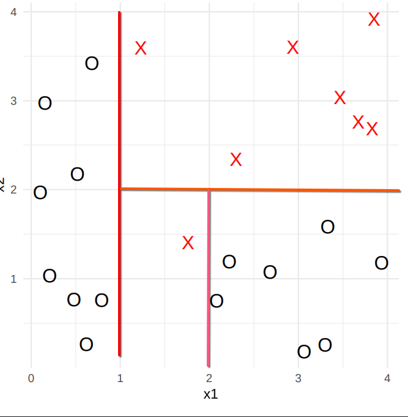 

$G = 2\frac{1 \times 0}{1^2} + 2\frac{0 \times 7}{7^2} = 0$

With these splits the decision tree looks like this:

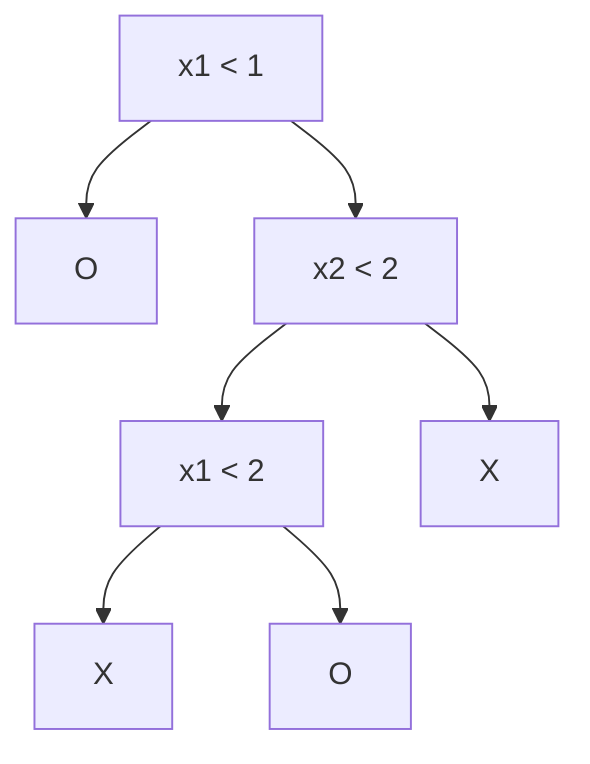

<div style="page-break-after: always;"></div>

# Problem 14
## Task a
In 1-NN only the closest point is observed. This means that the decision boundaries are between poitns in the training data where a class difference is.
From $x_2=2.0$ to $x_3=3.0$ the class switches from +1 to -1. This means that at 2.5 is a classification boundary. The following are the classification boundaries for 1-NN: [2.5, 4.0, 10.5, 14.0, 15.5]. 
| 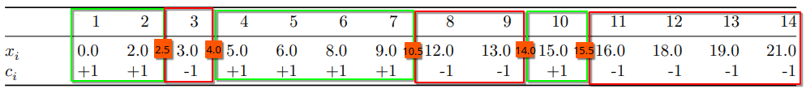 |
|:-:|
| In the above figure the boundaries are visible as the edges between the green and red rectangles. The green rectangles represent the +1 class area and the red the -1. |

The training error for 1-NN is 0, because each point would simply be classfied to its own class due to the closest point being itself.

In 3-NN the three closes points are observed and the most common class is selected. This means that if atleast two of the closest poitns are of a specific class then that class is chosen. This means that the classification boundaries 3.5 and 4.0 in 1-NN do not exist in 3-NN because there is ever only one point which is -1 when moving past them. The classification boundaries in 3-NN are: [10.5].

| 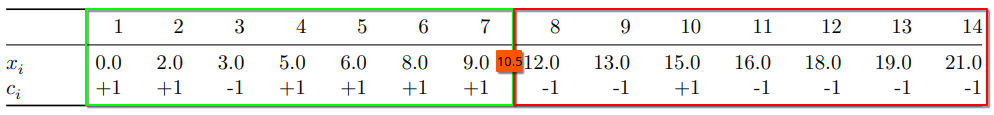 |
|:-:|
| In the above figure the boundary between +1 and -1 is visible as the edge between the green and red rectangles. |

To calculate the training error for the 3-NN the number of missclassified points need to be counted. In the above figure there is one -1 point in the green rectangle and one +1 pont in the red. In total two missclassified points in the training data. In otherwords the training error is $\frac{2}{14}=\frac{1}{7}$

## Task b
As k increases outlier data points affect the classification less. This may prune out smaller classification areas. 
Example of large k: Imagine a 2-dimensional dataset with 100 Xs and a larger amount of Os sourrounding the Xs. If k is set to 201 the whole area of Xs will be classified as Os.
Example of small k: Imagine a 2-dimensional dataset where there is a single X sourrounded by a lot of Os. If k is set to less than 3 there will be a decision boundary in the middle of the collection of Os.

<div style="page-break-after: always;"></div>

# Problem 15
## Task a
To select the hyper plane with the largest margin I need to make sure the line is as far from datapoints as possible while sperating the classes. From the figure and dataset I can see that there is a clear class separation in the interval (2.0, 4.0) on $x_1$. The support vectors are the points closest to the separation, which in this case are [D: (2.0, 0.0)] for class 1 and [E: (4.0, 1.0), F: (4.0, -1.0)] for class -1.

The both support vectors for class -1 have the same value on $x_1$, which means the hyper plane will need to be constant in the $x_1$ dimension. In other words I need to choose a value for $x_1$ that has the same distance to all support vectors' $x_1$ component. 

I choose the middle of the previously mentioned separation interval $x_1=3.0$. This means the hyperplane becomes:
$$3.0 - X_1=0$$

## Task b
The curve $(1+X_1)^2+(2-X_2)^2=4$ is a circle in the 2-dimensional space X. When plotted out it looks like this:
|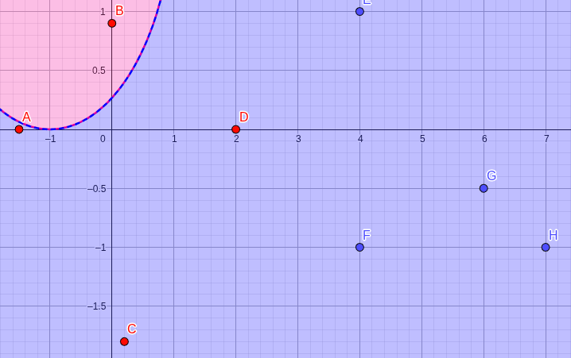|
|:-:|
| The red area is where $(1+X_1)^@+(2-X_2)^2\le4$ and the blue $(1+X_1)^@+(2-X_2)^2 \gt 4$. |
| The points maintain their original class in the plot, but if reclassfied B would be the only red and the rest would be blue. |

## Task c
To find out the class of the new points [(0,0), (-1,1), (2,2), (3,8)] i place them in the previous plot as I, J, K and L respectively:
|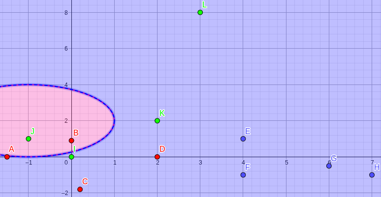|
|:-:|
| It is visible that J=(-1,1) is the only one that would be classified as red and the rest of the new points are blue.|
| Note that the $x_2$ acis has been rescaled to fit all the points in the plot. |

## Task d
The decision boundary $(1+X_1)^2+(2-X_2)^2=4$ can be expanded:
$$\implies (X_1^2+2X_1+1)+(X_2^2-4X_2+4)=4$$
$$\implies X_1^2 + X_2^2 + 2X_1 - 4X_2 + 5 = 4$$
$$\implies X_1^2 + X_2^2 + 2X_1 - 4X_2 + 1 = 0$$
Which is a linear function in the space $X_1^2, X_2^2, X_1, X_2$

# Problem 16
## Task a
I learned a lot about classifiers in this set and they make more sense than I initially thought. I do still struggle with higher dimensional datasets because I am used to being able to visualise things in my head, which is not vey easy with higher dimensions. I have encountered K-NN before, so it was easier to work with than the other classfiers, but the classification trees did remind me of quad- and octrees, which I have played around with before. 

## Task b 
I put around 17 hours into this exercise set.