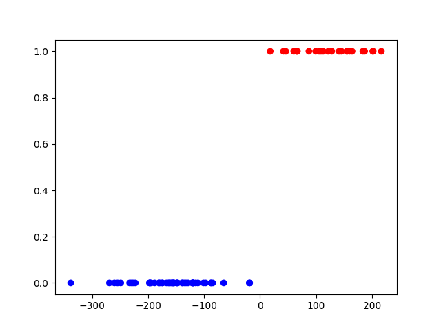
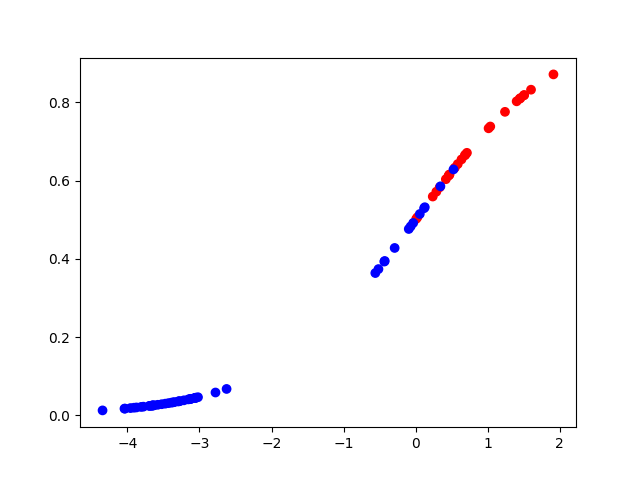

# Problem 1
## Task a
1. The 'species' column in both the training and testing data is replaced with the 'Adelie' column where 1 means Adelie and 0 is notAdelie. 
2. The intercept term is added to both the training X values and testing X values. 
3. `sm.Logit` is used to train a logistin regression model with the training data.
4. The accuracy is carculated by calling `results.predict()` on both data sets.
    - Probabilities over 0.5 are classified as Adelie.
5. A scatter plot is used to best show the distribution of the data.

The red data points are Adelie and the blu are not.

### Output
```bash
Coefficients
const                179.558317
bill_length_mm       -23.201690
bill_depth_mm         38.308170
flipper_length_mm     -0.039799
body_mass_g            0.036815
dtype: float64

Train accuracy: 1.0
Test accuracy: 0.9866666666666667
```

### Plot


### code
```python
import pandas as pd
import numpy as np
import statsmodels.api as sm
import matplotlib.pyplot as plt

trainDF = pd.read_csv('data/penguins_train.csv')
trainDF['Adelie'] = (trainDF['species'] == 'Adelie').astype(int)
trainDF = trainDF.drop(columns = ['species'])

testDF = pd.read_csv('data/penguins_test.csv')
testDF['Adelie'] = (testDF['species'] == 'Adelie').astype(int)
testDF = testDF.drop(columns = ['species'])

trainX = trainDF[['bill_length_mm', 'bill_depth_mm', 'flipper_length_mm', 'body_mass_g']]
trainX = sm.add_constant(trainX)

testX = testDF[['bill_length_mm', 'bill_depth_mm', 'flipper_length_mm', 'body_mass_g']]
testX = sm.add_constant(testX)

results = sm.Logit(trainDF['Adelie'], trainX).fit()

trainAccuracy = ((results.predict(trainX) > 0.5) == trainDF['Adelie']).mean()
testAccuracy = ((results.predict(testX) > 0.5) == testDF['Adelie']).mean()

print('Coefficients')
print(results.params)
print()
print('Train accuracy:', trainAccuracy)
print('Test accuracy:', testAccuracy)

linear_response = np.dot(trainX, results.params)
probs = results.predict(trainX)

col = np.where(trainDF['Adelie']==0,'b','r')

plt.scatter(linear_response, probs, color=col)
plt.show()
```

## Task b

### Output
```bash
Coefficients
const                0.000000
bill_length_mm      -0.084968
bill_depth_mm        0.557587
flipper_length_mm   -0.018480
body_mass_g         -0.000746
dtype: float64

Train accuracy: 0.9333333333333333
Test accuracy: 0.8933333333333333
```

### Plot



### code
```python
import pandas as pd
import numpy as np
import statsmodels.formula.api as smf
import statsmodels.api as sm
import matplotlib.pyplot as plt

trainDF = pd.read_csv('data/penguins_train.csv')
trainDF['Adelie'] = (trainDF['species'] == 'Adelie').astype(int)
trainDF = trainDF.drop(columns = ['species'])
testDF = pd.read_csv('data/penguins_test.csv')
testDF['Adelie'] = (testDF['species'] == 'Adelie').astype(int)
testDF = testDF.drop(columns = ['species'])

trainX = trainDF[['bill_length_mm', 'bill_depth_mm', 'flipper_length_mm', 'body_mass_g']]
trainX = sm.add_constant(trainX)

testX = testDF[['bill_length_mm', 'bill_depth_mm', 'flipper_length_mm', 'body_mass_g']]
testX = sm.add_constant(testX)

model = sm.GLM(trainDF['Adelie'], trainX, family=sm.families.Binomial())
results = model.fit_regularized(alpha=0.1, L1_wt=1.0)

print('Coefficients')
print(results.params)
print()

trainAccuracy = ((results.predict(trainX) > 0.5) == trainDF['Adelie']).mean()
testAccuracy = ((results.predict(testX) > 0.5) == testDF['Adelie']).mean()


print('Train accuracy:', trainAccuracy)
print('Test accuracy:', testAccuracy)

linear_response = np.dot(trainX, results.params)
probs = results.predict(trainX)

col = np.where(trainDF['Adelie']==0,'b','r')

plt.scatter(linear_response, probs, color=col)
plt.show()
```

## Task c
I got the following warnings in task a:
```bash
warnings.warn(msg, category=PerfectSeparationWarning)
... : PerfectSeparationWarning: Perfect separation or prediction detected, parameter may not be identified
Warning: Maximum number of iterations has been exceeded.
         Current function value: 0.000000
         Iterations: 35
ConvergenceWarning: Maximum Likelihood optimization failed to converge. Check mle_retvals
```
The first warning apperares multiple times each time the code is run, which is due to the likelyhood optimization being iterative.

The problem is that there is a a quasi-complete separation in some of the variables between the two classes. For example if we look at the dataset `penguins_train.csv` we see that the `bill_length_mm` variable has only a small overlap between the two species.
| Species   | bill_length_mm range |
|-----------|----------------------|
| Adelie    |        33 - 44       |
| NotAdelie |        43 - 60       |
There is only one observed Adelie with a bill length of 44mm

