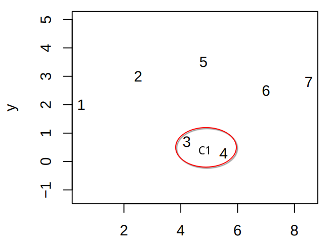
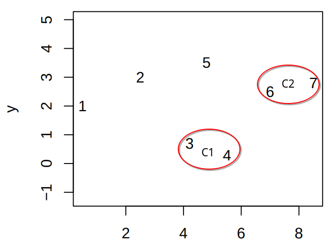
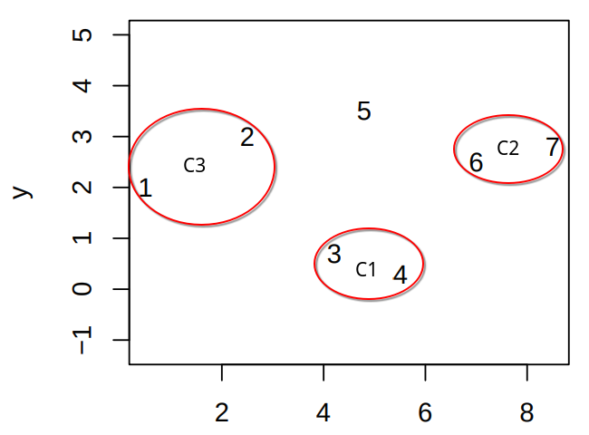
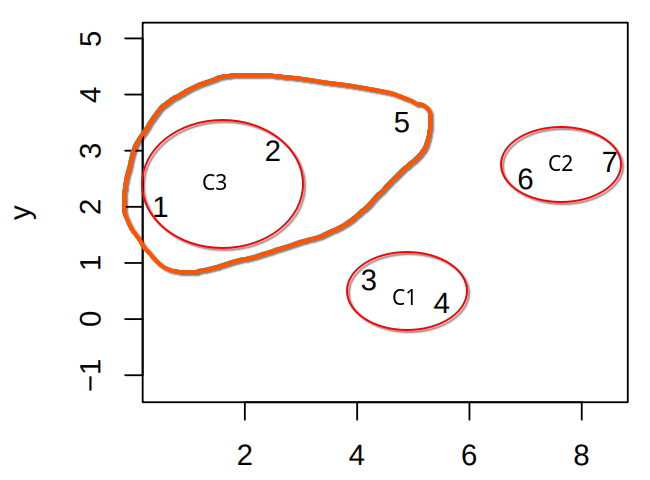
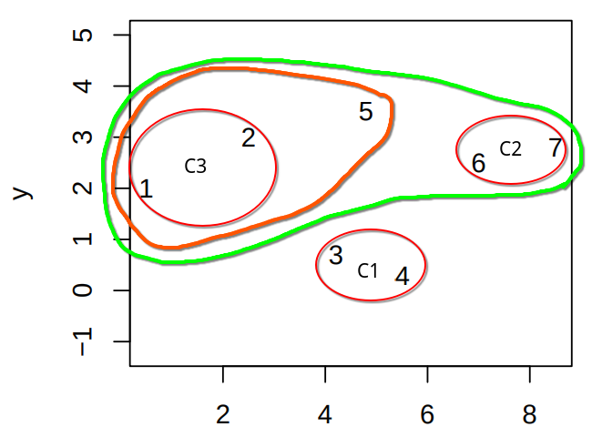
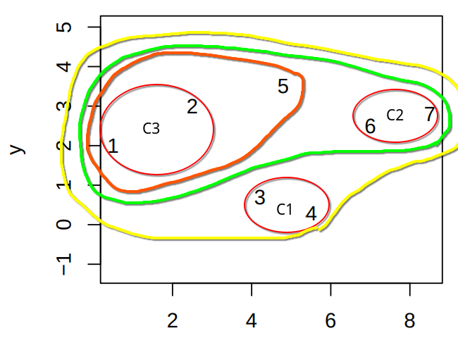
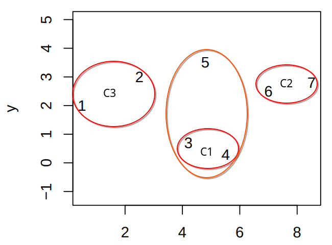
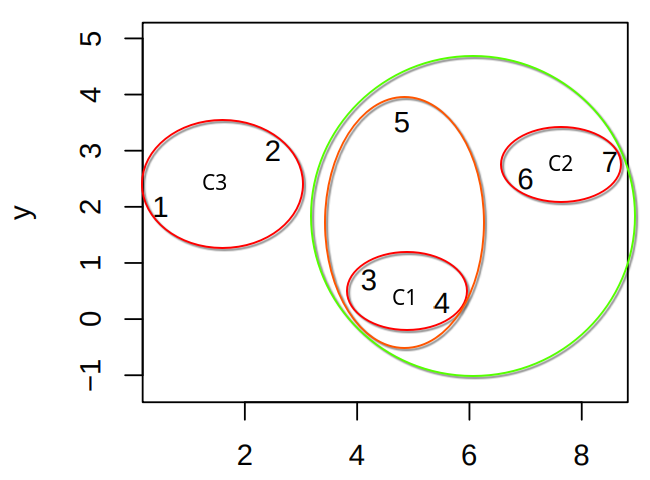
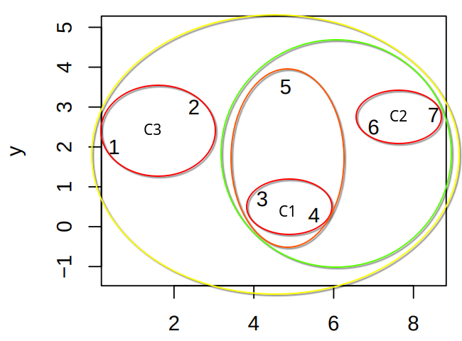
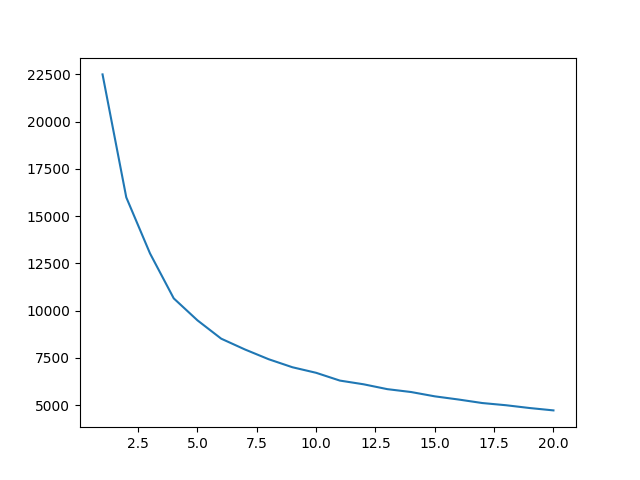

# Problem 17
## Task a
1. **For what kinds of tasks can we use the k-means algorithm?**
- K-means algorithm can be used for clustering, which is useful in unsupervised learning where observations do not fall under any predefined class. K-means group similar observations together into K number of clusters. 
2. **What are the algorithm’s inputs and outputs?**
- K-means takes a number K and a dataset with n observations with p features. The only requirement is that $K >= n$. The algorithm outputs cluster assignments for the dataset and the centroids for each cluster. Each observation is assigned to one of K clusters.
3. **How should you interpret the results?**
The clusters assignments are groups of observations that are close to eachother, or in other words, have similar features. The centroids are vectors with components that represent the average values for each feature within the cluster.

## Task b

K-means aims to minimize the within-cluster variation. Instead of calculating the variation by taking the difference between each observation in the cluster, the algorithm takes the distance from the observations to the cluster centroids. The cluster centroids contain the feature means of the observations in the cluster.

The centroid for cluster $C_k$ is calcluated by:
$$
\mu_k = \frac{1}{|C_k|} \sum_{i \in C_k}x_{i}
$$
where $|C_k|$ is the number of observations in the cluster.


The algorithm calculates the similarity between an observation $x_i$ and the cluster centroid $mu_k$ by using squared euclidian distance.

$$
||x_i - \mu_i||^2 = \sum^p_{j=1}\sqrt{( x_{ij} - \mu_{kj} )^2}^2 = \sum^p_{j=1}( x_{ij} - \mu_{kj} )^2
$$

where $x_{ij}$ and $\mu_{kj}$ are the jth feature of observation $x_i$ and the jth feature of the cluster $C_k$'s centroid.

The similarity measures between each observation and its cluster centroid are summed up over all clusters.

$$
\sum^K_{k=1} \sum_{i \in C_k} ||x_i - \mu_k||^2
$$

which can be expanded using the previous steps into:

$$
\sum^K_{k=1} \sum_{i \in C_k} \sum^p_{j=1}( x_{ij} - \frac{1}{|C_k|} \sum_{i' \in C_k}x_{i'} )^2
$$

## Task c
toy data = 
| i | x | y |
|---|---|---|
| 1 | 0 | 1 | 
| 2 | 1 | 2 | 
| 3 | 4 | 5 |
| 4 | 5 | 3 |
| 5 | 5 | 4 |
### Iteration 1
$\mu_1={1,4}$
$\mu_2={4,1}$


| i | $\mu$ | Calculation |
| - | - | - |
| 1 | 1 | $(0 - 1)^2 + (1 - 4)^2 = 1 + 9 = 10$ |
| 1 | 2 | $(0 - 4)^2 + (1 - 1)^2 = 16 + 0 = 16$ |
| 2 | 1 | $(1 - 1)^2 + (2 - 4)^2 = 0 + 4 = 4$ |
| 2 | 2 | $(1 - 4)^2 + (2 - 1)^2 = 9 + 1 = 10$ |
| 3 | 1 | $(4 - 1)^2 + (5 - 4)^2 = 9 + 1 = 10$ |
| 3 | 2 | $(4 - 4)^2 + (5 - 1)^2 = 0 + 16 = 16$ |
| 4 | 1 | $(5 - 1)^2 + (3 - 4)^2 = 16 + 1 = 17$ |
| 4 | 2 | $(5 - 4)^2 + (3 - 1)^2 = 1 + 4 = 5$ |
| 5 | 1 | $(5 - 1)^2 + (4 - 4)^2 = 16 + 0 = 16$ |
| 5 | 2 | $(5 - 4)^2 + (4 - 1)^2 = 1 + 9 = 10$ |


#### Cluster assignments
| Cluster | Observations | mean vector |
| - | - | - |
| 1 | 1, 2, 3 | $\frac{(0, 1) + (1, 2) + (4, 5)}{3} = (\frac{5}{3},\frac{8}{3})$ |
| 2 | 4, 5 | $\frac{(5,3) + (5,4)}{2} = (5,\frac{7}{2})$ |

#### Cost calculation
The squared distances are taken from the table in the next iteration.

$||x_1 - \mu_1||^2 + ||x_2 - \mu_1||^2 + ||x_3 - \mu_1||^2 + ||x_4 - \mu_2||^2 + ||x_5 - \mu_2|| + 5.5555... + 0.8888... + 10.8888 + 0.25 + 0.25 = 9.4166...$

### Iteration 2
$\mu_1 = (\frac{5}{3},\frac{8}{3})$
$\mu_2 = (5,\frac{7}{2})$

| i | $\mu$ | Calculation |
| - | - | - |
| 1 | 1 | $(0 - \frac{5}{3})^2 + (1 - \frac{8}{3})^2 = \frac{5}{3}^2 + \frac{5}{3}^2 = 5.5555...$ |
| 1 | 2 | $(0 - 5)^2 + (1 - \frac{7}{2})^2 = 25 + 2.5^2 = 31.25$ |
| 2 | 1 | $(1 - \frac{5}{3})^2 + (2 - \frac{8}{3})^2 = \frac{2}{3}^2 + \frac{2}{3}^2 = 0.8888...$ |
| 2 | 2 | $(1 - 5)^2 + (2 - \frac{7}{2})^2 = 16 + 1.5^2 = 18.25$ |
| 3 | 1 | $(4 - \frac{5}{3})^2 + (5 - \frac{8}{3})^2 = \frac{7}{3}^2 + \frac{7}{3}^2 = 10.8888...$ |
| 3 | 2 | $(4 - 5)^2 + (5 - \frac{7}{2})^2 = 1 + 1.5^2 = 3.25$ |
| 4 | 1 | $(5 - \frac{5}{3})^2 + (3 - \frac{8}{3})^2 = \frac{10}{3}^2 + \frac{1}{3}^2 = 11.2222...$ |
| 4 | 2 | $(5 - 5)^2 + (3 - \frac{7}{2})^2 = 0 + 0.5^2 = 0.25$ |
| 5 | 1 | $(5 - \frac{5}{3})^2 + (4 - \frac{8}{3})^2 = \frac{10}{3}^2 + \frac{4}{3}^2 = 12.8888...$ |
| 5 | 2 | $(5 - 5)^2 + (4 - \frac{7}{2})^2 = 0 + 0.5^2 = 0.25$ |

#### Cluster assignments
| Cluster | Observations | mean vector |
| - | - | - |
| 1 | 1, 2 | $\frac{(0, 1) + (1, 2)}{2} = (0.5,1.5)$ |
| 2 | 3, 4, 5 | $\frac{(4, 5) + (5,3) + (5,4)}{3} = (\frac{14}{3},4)$ |

#### Cost calculation
The squared distances are taken from the table in the next iteration.

$||x_1 - \mu_1||^2 + ||x_2 - \mu_1||^2 + ||x_3 - \mu_1||^2 + ||x_4 - \mu_2||^2 + ||x_5 - \mu_2|| + 5.5 + 0.5 + 1.4444... + 1.1111... + 0.4444... = 8.9999...$

### Iteration 3
$\mu_1 = (0.5,1.5)$
$\mu_2 = (\frac{14}{3},4)$

| i | $\mu$ | Calculation |
| - | - | - |
| 1 | 1 | $(0 - 0.5)^2 + (1 - 1.5)^2 = 0.5^2 + 0.5^2 = 0.5$ |
| 1 | 2 | $(0 - \frac{14}{3})^2 + (1 - 4)^2 = \frac{14}{3}^2 + 9 = 30.7777...$ |
| 2 | 1 | $(1 - 0.5)^2 + (2 - 1.5)^2 = 0.5^2 + 0.5^2 = 0.5$ |
| 2 | 2 | $(1 - \frac{14}{3})^2 + (2 - 4)^2 = \frac{11}{3}^2 + 4 = 17.4444...$ |
| 3 | 1 | $(4 - 0.5)^2 + (5 - 1.5)^2 = 3.5^2 + 3.5^2 = 24.5$ |
| 3 | 2 | $(4 - \frac{14}{3})^2 + (5 - 4)^2 = \frac{2}{3}^2 + 1 = 1.4444$ |
| 4 | 1 | $(5 - 0.5)^2 + (3 - 1.5)^2 = 4.5^2 + 1.5^2 = 22.5$ |
| 4 | 2 | $(5 - \frac{14}{3})^2 + (3 - 4)^2 = \frac{1}{3}^2 + 1 = 1.1111...$ |
| 5 | 1 | $(5 - 0.5)^2 + (4 - 1.5)^2 = 4.5^2 + 2.5^2 = 26.5$ |
| 5 | 2 | $(5 - \frac{14}{3})^2 + (4 - 4)^2 = \frac{2}{3}^2 + 0 = 0.4444$ |


#### Cluster assignments
No changes to the cluster assignments, therefore the run stops here.
| Cluster | Observations | mean vector |
| - | - | - |
| 1 | 1, 2 | (0.5,1.5)$ |
| 2 | 3, 4, 5 | (\frac{14}{3},4)$ |

#### Final cost
The cost stays the same as the previous iteration. 8.9999...

# Problem 18

## Task a
The algorithm starts by placing all observations into their own clusters, which means there are 7 clusters in the beginning.
### Iteration 1
Because all clusters only contain one observation it is easy to caluclate similarty using euclidean distance between the obsevations.

The closest clusters (or observations in this case) are 3 and 4 with a distance of 1.36



### Iteration 2
To compute the new inter cluster dissimiliarities to the new cluster $C_1$ the closest observation in $C_1$ is used.

The closest clusters are 6 and 7 with a distance of 1.53.



### Iteration 3
The closest clusters are 1 and 2 with a distance of 2.24.



### Iteration 4
The closest inter cluster observations are 2 and 5 with a distance of 2.35. This means observation 5 is fused with cluster $C_3$



### Iteration 5
The closest inter cluster observations are 5 and 6 with a distance of 2.42. This means clusters $C_3$ and $C_2$ are fused.



### Iteration 6
There are two remaining clusters, with the closest inter cluster observations being 4 and 6. The remaining clusters are fused.



## Task b
The algorithm starts by placing all observations into their own clusters, which means there are 7 clusters in the beginning. The first three iterations will be the same as in task a. This is because first three links were formed between singular observations, where the inter cluster linkage method does not apply yet. I will therefore start from iteration 3 in task a

### Iteration 3
The closest clusters are 1 and 2 with a distance of 2.24.


### Iteration 4
By comparing the furthest away observations between the clusters, I find that 5 and $C_1$ are the closest with the observations 5 and 7 and distance 3.28.



### Iteration 5
The smallest intercluster complete link is betwwen $C_2$ and $C_1$ with observations 7 and 3 and distance 4.79.



### Iteration 6
There are two clusters remaining, which means they will be joined. Their observations furthest from eachother are 1 and 7 with a distance of 8.04.



As previously mentioned the first three iterations are identical, because replacing the single link with complete link does not affect distance between single observations. It only icnreases distances to clusters contining multiple observations. The clusters produced by single link are elongated compared to the compact clusters in the complete link. Single link compares only the closest observations, which ignores the fact that a cluster may by large with observations much further away. By comparing the furthes away observations, the new cluster is more likely to be smaller.

# Problem 19
## Task a


The columns need to be normalized, because the similiarity is calculated with euclidian distance. The columns are not necessarily scaled equally by default, which means that certain features affect the clustering more than others.

## Task b

### Output
```bash
      class      1      2    3     4
0        II   13.0   32.0  0.0  72.0
1        Ia    5.0    1.0  0.0  20.0
2        Ib    4.0   15.0  0.0  63.0
3  nonevent  107.0  100.0  4.0  14.0
```

Despite using four clusters, one of the clusters (in this case 3) ends up allmost empty. If each class were assigned to the cluster most of their observations are in, classes 'II' 'Ia' and 'Ib' would fall into the same cluster (in this case 4). While the nonevent class is mostly separated from the other events it is also split up almost equally between two classes. 