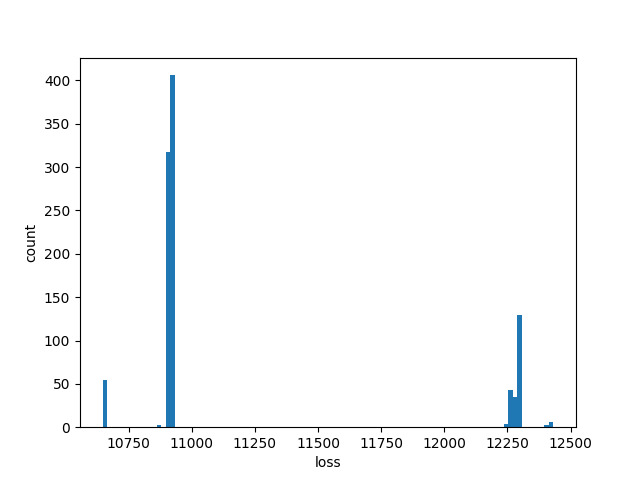
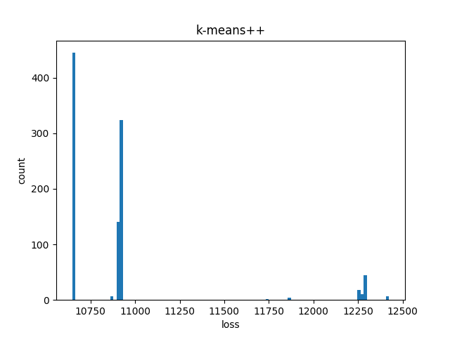
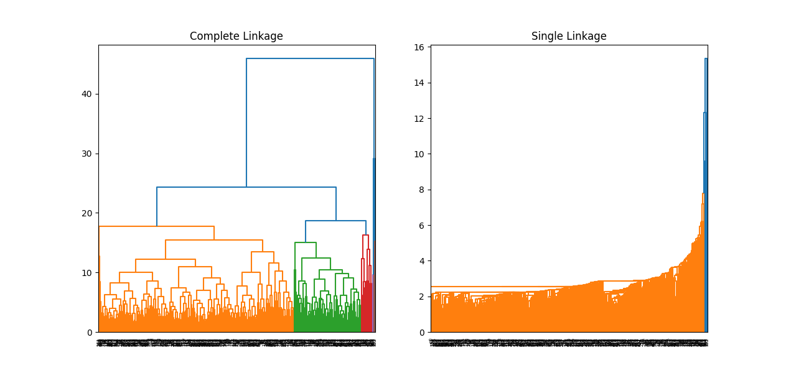
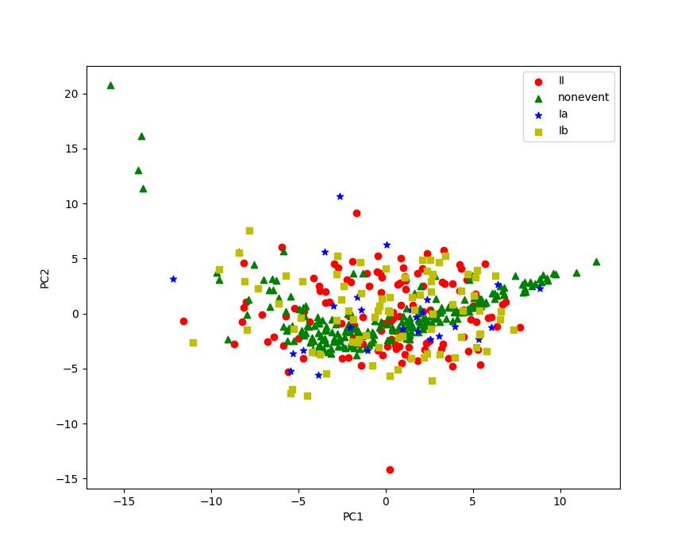
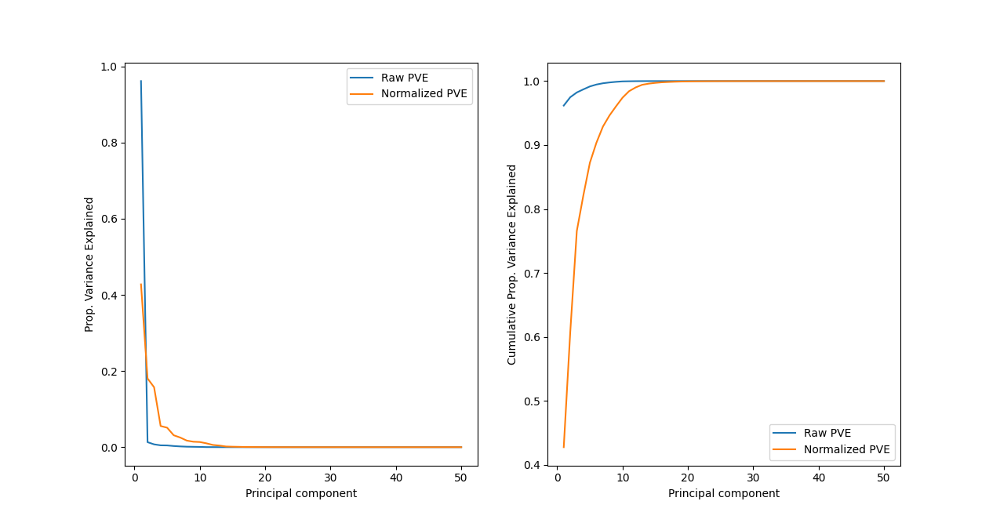
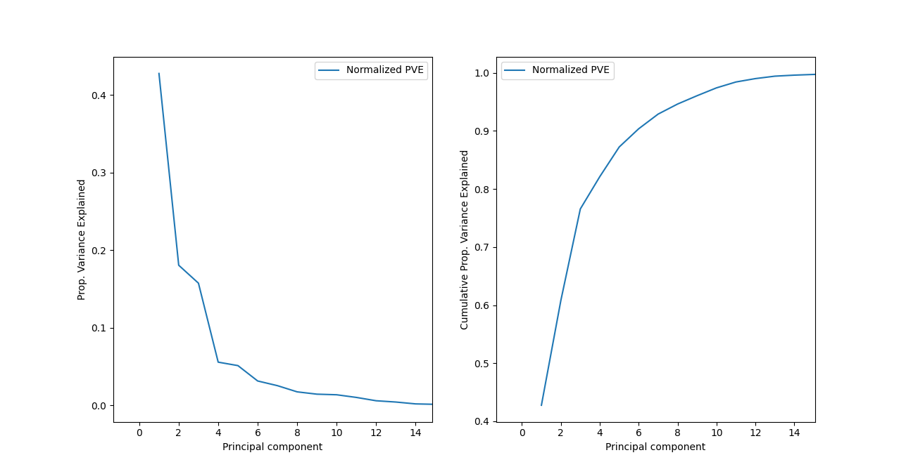

# Problem 17
## Task a
1. **For what kinds of tasks can we use the k-means algorithm?**
- K-means algorithm can be used for clustering, which is useful in unsupervised learning where observations do not fall under any predefined class. K-means group similar observations together into K number of clusters. 
2. **What are the algorithm’s inputs and outputs?**
- K-means takes a number K and a dataset with n observations with p features. The only requirement is that $K >= n$. The algorithm outputs cluster assignments for the dataset and the centroids for each cluster. Each observation is assigned to one of K clusters.
3. **How should you interpret the results?**
The clusters assignments are groups of observations that are close to eachother, or in other words, have similar features. The centroids are vectors with components that represent the average values for each feature within the cluster.

## Task b

K-means aims to minimize the within-cluster variation. Instead of calculating the variation by taking the difference between each observation in the cluster, the algorithm takes the distance from the observations to the cluster centroids. The cluster centroids contain the feature means of the observations in the cluster.

The centroid for cluster $C_k$ is calcluated by:
$$
\mu_k = \frac{1}{|C_k|} \sum_{i \in C_k}x_{i}
$$
where $|C_k|$ is the number of observations in the cluster.


The algorithm calculates the similarity between an observation $x_i$ and the cluster centroid $mu_k$ by using squared euclidian distance.

$$
||x_i - \mu_i||^2 = \sum^p_{j=1}\sqrt{( x_{ij} - \mu_{kj} )^2}^2 = \sum^p_{j=1}( x_{ij} - \mu_{kj} )^2
$$

where $x_{ij}$ and $\mu_{kj}$ are the jth feature of observation $x_i$ and the jth feature of the cluster $C_k$'s centroid.

The similarity measures between each observation and its cluster centroid are summed up over all clusters.

$$
\sum^K_{k=1} \sum_{i \in C_k} ||x_i - \mu_k||^2
$$

which can be expanded using the previous steps into:

$$
\sum^K_{k=1} \sum_{i \in C_k} \sum^p_{j=1}( x_{ij} - \frac{1}{|C_k|} \sum_{i' \in C_k}x_{i'} )^2
$$

## Task c
toy data = 
| i | x | y |
|---|---|---|
| 1 | 0 | 1 | 
| 2 | 1 | 2 | 
| 3 | 4 | 5 |
| 4 | 5 | 3 |
| 5 | 5 | 4 |
### Iteration 1
$\mu_1={1,4}$
$\mu_2={4,1}$


| i | $\mu$ | Calculation |
| - | - | - |
| 1 | 1 | $(0 - 1)^2 + (1 - 4)^2 = 1 + 9 = 10$ |
| 1 | 2 | $(0 - 4)^2 + (1 - 1)^2 = 16 + 0 = 16$ |
| 2 | 1 | $(1 - 1)^2 + (2 - 4)^2 = 0 + 4 = 4$ |
| 2 | 2 | $(1 - 4)^2 + (2 - 1)^2 = 9 + 1 = 10$ |
| 3 | 1 | $(4 - 1)^2 + (5 - 4)^2 = 9 + 1 = 10$ |
| 3 | 2 | $(4 - 4)^2 + (5 - 1)^2 = 0 + 16 = 16$ |
| 4 | 1 | $(5 - 1)^2 + (3 - 4)^2 = 16 + 1 = 17$ |
| 4 | 2 | $(5 - 4)^2 + (3 - 1)^2 = 1 + 4 = 5$ |
| 5 | 1 | $(5 - 1)^2 + (4 - 4)^2 = 16 + 0 = 16$ |
| 5 | 2 | $(5 - 4)^2 + (4 - 1)^2 = 1 + 9 = 10$ |


#### Cluster assignments
| Cluster | Observations | mean vector |
| - | - | - |
| 1 | 1, 2, 3 | $\frac{(0, 1) + (1, 2) + (4, 5)}{3} = (\frac{5}{3},\frac{8}{3})$ |
| 2 | 4, 5 | $\frac{(5,3) + (5,4)}{2} = (5,\frac{7}{2})$ |

#### Cost calculation
The squared distances are taken from the table in the next iteration.

$||x_1 - \mu_1||^2 + ||x_2 - \mu_1||^2 + ||x_3 - \mu_1||^2 + ||x_4 - \mu_2||^2 + ||x_5 - \mu_2|| + 5.5555... + 0.8888... + 10.8888 + 0.25 + 0.25 = 9.4166...$

### Iteration 2
$\mu_1 = (\frac{5}{3},\frac{8}{3})$
$\mu_2 = (5,\frac{7}{2})$

| i | $\mu$ | Calculation |
| - | - | - |
| 1 | 1 | $(0 - \frac{5}{3})^2 + (1 - \frac{8}{3})^2 = \frac{5}{3}^2 + \frac{5}{3}^2 = 5.5555...$ |
| 1 | 2 | $(0 - 5)^2 + (1 - \frac{7}{2})^2 = 25 + 2.5^2 = 31.25$ |
| 2 | 1 | $(1 - \frac{5}{3})^2 + (2 - \frac{8}{3})^2 = \frac{2}{3}^2 + \frac{2}{3}^2 = 0.8888...$ |
| 2 | 2 | $(1 - 5)^2 + (2 - \frac{7}{2})^2 = 16 + 1.5^2 = 18.25$ |
| 3 | 1 | $(4 - \frac{5}{3})^2 + (5 - \frac{8}{3})^2 = \frac{7}{3}^2 + \frac{7}{3}^2 = 10.8888...$ |
| 3 | 2 | $(4 - 5)^2 + (5 - \frac{7}{2})^2 = 1 + 1.5^2 = 3.25$ |
| 4 | 1 | $(5 - \frac{5}{3})^2 + (3 - \frac{8}{3})^2 = \frac{10}{3}^2 + \frac{1}{3}^2 = 11.2222...$ |
| 4 | 2 | $(5 - 5)^2 + (3 - \frac{7}{2})^2 = 0 + 0.5^2 = 0.25$ |
| 5 | 1 | $(5 - \frac{5}{3})^2 + (4 - \frac{8}{3})^2 = \frac{10}{3}^2 + \frac{4}{3}^2 = 12.8888...$ |
| 5 | 2 | $(5 - 5)^2 + (4 - \frac{7}{2})^2 = 0 + 0.5^2 = 0.25$ |

#### Cluster assignments
| Cluster | Observations | mean vector |
| - | - | - |
| 1 | 1, 2 | $\frac{(0, 1) + (1, 2)}{2} = (0.5,1.5)$ |
| 2 | 3, 4, 5 | $\frac{(4, 5) + (5,3) + (5,4)}{3} = (\frac{14}{3},4)$ |

#### Cost calculation
The squared distances are taken from the table in the next iteration.

$||x_1 - \mu_1||^2 + ||x_2 - \mu_1||^2 + ||x_3 - \mu_1||^2 + ||x_4 - \mu_2||^2 + ||x_5 - \mu_2|| + 5.5 + 0.5 + 1.4444... + 1.1111... + 0.4444... = 8.9999...$

### Iteration 3
$\mu_1 = (0.5,1.5)$
$\mu_2 = (\frac{14}{3},4)$

| i | $\mu$ | Calculation |
| - | - | - |
| 1 | 1 | $(0 - 0.5)^2 + (1 - 1.5)^2 = 0.5^2 + 0.5^2 = 0.5$ |
| 1 | 2 | $(0 - \frac{14}{3})^2 + (1 - 4)^2 = \frac{14}{3}^2 + 9 = 30.7777...$ |
| 2 | 1 | $(1 - 0.5)^2 + (2 - 1.5)^2 = 0.5^2 + 0.5^2 = 0.5$ |
| 2 | 2 | $(1 - \frac{14}{3})^2 + (2 - 4)^2 = \frac{11}{3}^2 + 4 = 17.4444...$ |
| 3 | 1 | $(4 - 0.5)^2 + (5 - 1.5)^2 = 3.5^2 + 3.5^2 = 24.5$ |
| 3 | 2 | $(4 - \frac{14}{3})^2 + (5 - 4)^2 = \frac{2}{3}^2 + 1 = 1.4444$ |
| 4 | 1 | $(5 - 0.5)^2 + (3 - 1.5)^2 = 4.5^2 + 1.5^2 = 22.5$ |
| 4 | 2 | $(5 - \frac{14}{3})^2 + (3 - 4)^2 = \frac{1}{3}^2 + 1 = 1.1111...$ |
| 5 | 1 | $(5 - 0.5)^2 + (4 - 1.5)^2 = 4.5^2 + 2.5^2 = 26.5$ |
| 5 | 2 | $(5 - \frac{14}{3})^2 + (4 - 4)^2 = \frac{2}{3}^2 + 0 = 0.4444$ |


#### Cluster assignments
No changes to the cluster assignments, therefore the run stops here.
| Cluster | Observations | mean vector |
| - | - | - |
| 1 | 1, 2 | (0.5,1.5)$ |
| 2 | 3, 4, 5 | (\frac{14}{3},4)$ |

#### Final cost
The cost stays the same as the previous iteration. 8.9999...

# Problem 18

## Task a
The algorithm starts by placing all observations into their own clusters, which means there are 7 clusters in the beginning.
### Iteration 1
Because all clusters only contain one observation it is easy to caluclate similarty using euclidean distance between the obsevations.

The closest clusters (or observations in this case) are 3 and 4 with a distance of 1.36


### Iteration 2
To compute the new inter cluster dissimiliarities to the new cluster $C_1$ the closest observation in $C_1$ is used.

The closest clusters are 6 and 7 with a distance of 1.53.


### Iteration 3
The closest clusters are 1 and 2 with a distance of 2.24.


### Iteration 4
The closest inter cluster observations are 2 and 5 with a distance of 2.35. This means observation 5 is fused with cluster $C_3$


### Iteration 5
The closest inter cluster observations are 5 and 6 with a distance of 2.42. This means clusters $C_3$ and $C_2$ are fused.


### Iteration 6
There are two remaining clusters, with the closest inter cluster observations being 4 and 6. The remaining clusters are fused.


## Task b
The algorithm starts by placing all observations into their own clusters, which means there are 7 clusters in the beginning. The first three iterations will be the same as in task a. This is because first three links were formed between singular observations, where the inter cluster linkage method does not apply yet. I will therefore start from iteration 3 in task a

### Iteration 3
The closest clusters are 1 and 2 with a distance of 2.24.


### Iteration 4
By comparing the furthest away observations between the clusters, I find that 5 and $C_1$ are the closest with the observations 5 and 7 and distance 3.28.


### Iteration 5
The smallest intercluster complete link is betwwen $C_2$ and $C_1$ with observations 7 and 3 and distance 4.79.


### Iteration 6
There are two clusters remaining, which means they will be joined. Their observations furthest from eachother are 1 and 7 with a distance of 8.04.


As previously mentioned the first three iterations are identical, because replacing the single link with complete link does not affect distance between single observations. It only icnreases distances to clusters contining multiple observations. The clusters produced by single link are elongated compared to the compact clusters in the complete link. Single link compares only the closest observations, which ignores the fact that a cluster may by large with observations much further away. By comparing the furthes away observations, the new cluster is more likely to be smaller.

# Problem 19
## Task a


The columns need to be normalized, because the similiarity is calculated with euclidian distance. The columns are not necessarily scaled equally by default, which means that certain features affect the clustering more than others.

### code
1. `KMeans` from the `sklearn` library is run on the data independently for 1 to 20 clusters.
2. The losses are recorded of KMeans is recorded by extracting the `_inertia` parameter.
3. The losses are plotted out as a function of the number of clusters.
```python
import pandas as pd
import numpy as np
import matplotlib.pyplot as plt
from sklearn.cluster import KMeans
from sklearn.preprocessing import StandardScaler

trainDF = pd.read_csv('data/train.csv')

scaler = StandardScaler()
X = scaler.fit_transform(trainDF.filter(regex=r'\.mean$'))

losses = []

for K in range(1, 21):
    kmeans = KMeans(n_clusters=K, random_state=2, n_init=10, init='random').fit(X)
    losses.append(kmeans.inertia_)

plt.plot(np.linspace(1, 20, 20), losses)
plt.show()
```

## Task b
### Code
1. `KMeans` from the `sklearn` library is run on the data with 4 clusters.
2. A contingency table is constructed using the labels returned by `KMeans`.
3. `linear_sum_assignment` from `scipy` is used to order the contingency table by maximizing the sum of the diagonal elements. This prodcues a confusion matrix.
```python
import pandas as pd
import numpy as np
import matplotlib.pyplot as plt
from sklearn.cluster import KMeans
from sklearn.preprocessing import StandardScaler
from scipy.optimize import linear_sum_assignment

trainDF = pd.read_csv('data/train.csv')

scaler = StandardScaler(with_mean=True, with_std=True)

X = scaler.fit_transform(trainDF.filter(regex=r'\.mean$'))

kmeans = KMeans(n_clusters=4, random_state=2, n_init=10, init='random').fit(X)

contingency = pd.DataFrame({ 'class': trainDF['class4'], 'cluster': kmeans.labels_})
contingency = contingency.groupby(['class', 'cluster']).size().unstack()
contingency = contingency.fillna(0)

lsa = linear_sum_assignment(contingency, maximize = True)

print(contingency[lsa[1]])


```

### Output
```bash
cluster      1    3     0      2
class                           
II        30.0  0.0  70.0   17.0
Ia         1.0  0.0  18.0    7.0
Ib        14.0  0.0  61.0    7.0
nonevent  97.0  9.0  18.0  101.0
```

Using this contingency table the class mappings become: 

|Cluster|Class    |
|-------|---------|
| 0     | Ib      |
| 1     | II      |
| 2     | nonevent|
| 3     | Ia      |

This means that the errors per class are:
| Class     | Errors            |
|-|-|
| II        | 70 + 17 = 87      |
| Ia        | 1 + 18 + 7 = 26   |
| Ib        | 14 + 7 = 21       |
| nonevent  | 97 + 9 + 18 = 124 |

Nonevent has the most missclassified observations, but Ia has all its observations missclassified.

## Task c
### I


```bash
Max loss 12440.854500553978
Min loss 10646.871669424883
```

From the histogram we can see that about 50 of the 1000 runs fall into the 1% range of the minimum loss. This makes the probability of a good run $p=\frac{50}{1000}=0.05$. The estimated number of iteration until one good run becomes: $\frac{1}{0.05}=20$

### II


```bash
Max loss 12424.835358011127
Min loss 10646.871669424883
```

There is a substantial increase in the low losses. From the histogram it seems about 450 of the 1000 iterations produce losses within 1% of the lowest loss. This makes the probability: $p = \frac{450}{1000}=0.45$ and the estimated number of iterations become: $\frac{1}{0.45}=2.2222...$, which can be rounded up to 3.

The number of frequency of low losses was not the only thing that k-means++ improved. It also lowered the highest loss. The lowset loss remained almost unaffected however.

### Code
There are two different loops: one for part (I) and one for part (II). The only difference is the initialization, which is random in the first and KMeans++ in the second. 
1. KMeans is run 1000 times on the data with 4 clusters and the losses are recorded.
2. The minimum and maximum losses are printed.
3. A histogram of the distribution of the losses is plotted.
```python
import pandas as pd
import numpy as np
import matplotlib.pyplot as plt
from sklearn.cluster import KMeans
from sklearn.preprocessing import StandardScaler
from scipy.optimize import linear_sum_assignment

trainDF = pd.read_csv('data/train.csv')

scaler = StandardScaler(with_mean=True, with_std=True)

X = scaler.fit_transform(trainDF.filter(regex=r'\.mean$'))

## I
losses = np.array([])

for i in range (0, 1000):
    kmeans = KMeans(n_clusters=4, n_init=1, init='random').fit(X)
    losses = np.append(losses, kmeans.inertia_)
print('random')
print('Max loss', np.max(losses))
print('Min loss', np.min(losses))

plt.hist(losses, 100)
plt.xlabel('loss')
plt.ylabel('count')
plt.title('random')
plt.show()


## II
losses = np.array([])

for i in range (0, 1000):
    kmeansplus = KMeans(n_clusters=4, n_init=1, init='k-means++').fit(X)
    losses = np.append(losses, kmeansplus.inertia_)

print('Max loss', np.max(losses))
print('Min loss', np.min(losses))

plt.hist(losses, 100)
plt.xlabel('loss')
plt.ylabel('count')
plt.title('k-means++')
plt.show()
```

## Task d
### I



#### Output
```bash
Complete cluster labels
[0 0 0 0 1 0 0 0 0 0 0 0 0 0 0 0 0 0 0 0 1 0 0 0 0 0 0 0 0 0 0 0 0 0 0 0 0
 0 0 0 0 0 0 0 0 0 0 0 0 0 0 0 0 0 0 0 0 0 0 0 0 0 0 0 0 0 0 0 0 0 0 0 0 0
 0 1 1 1 1 1 1 1 1 1 1 1 1 1 1 1 1 1 1 1 0 0 0 1 0 0 0 0 0 0 0 0 0 0 0 0 0
 0 0 0 0 0 0 0 0 0 0 0 0 1 1 1 1 1 1 1 1 1 1 1 1 1 1 1 1 1 1 1 0 1 0 0 0 0
 0 0 0 0 0 0 0 0 0 0 0 0 0 0 0 0 0 0 0 0 0 0 0 0 0 0 0 0 0 0 0 0 0 0 0 1 0
 1 1 1 1 1 1 1 1 2 1 1 1 1 1 1 1 0 0 1 1 0 0 0 0 0 0 0 0 1 0 0 0 0 0 0 0 0
 0 0 0 0 0 0 0 0 0 0 0 0 0 1 1 1 0 0 0 0 0 0 0 0 0 0 0 1 0 0 0 0 0 0 0 0 0
 0 0 0 0 0 0 0 0 0 0 0 0 0 0 1 1 1 0 0 0 1 1 0 0 0 0 0 0 0 0 0 0 0 0 0 0 0
 0 0 0 0 0 0 0 0 0 0 0 1 1 1 1 1 1 1 1 0 1 1 1 0 0 0 0 0 0 0 0 0 0 0 0 0 0
 0 0 0 0 0 0 0 0 0 0 0 0 0 0 0 1 1 1 1 2 1 1 1 1 1 1 1 1 1 1 1 3 1 3 1 1 1
 1 1 1 1 1 1 0 1 0 0 0 0 0 0 0 0 1 0 0 0 0 0 0 0 0 0 0 0 0 1 0 0 0 0 0 0 0
 0 0 0 0 1 1 1 1 1 1 1 1 1 1 1 1 1 1 1 1 1 1 1 0 0 0 0 0 0 0 0 0 0 0 0 0 0
 0 0 0 0 0 0]

Single cluster labels
[0 0 0 0 0 0 0 0 0 0 0 0 0 0 0 0 0 0 0 0 0 0 0 0 0 0 0 0 0 0 0 0 0 0 0 0 0
 0 0 0 0 0 0 0 0 0 0 0 0 0 0 0 0 0 0 0 0 0 0 0 0 0 0 0 0 0 0 0 0 0 0 0 0 0
 0 0 0 0 0 0 0 0 0 0 0 0 0 0 0 0 0 0 0 0 0 0 0 0 0 0 0 0 0 0 0 0 0 0 0 0 0
 0 0 0 0 0 0 0 0 0 0 0 0 0 0 0 0 0 0 0 0 0 0 0 0 0 0 0 0 0 0 0 0 0 0 0 0 0
 0 0 0 0 0 0 0 0 0 0 0 0 0 0 0 0 0 0 0 0 0 0 0 0 0 0 0 0 0 0 0 0 0 0 0 0 0
 0 0 0 0 0 0 0 0 1 0 0 0 0 0 0 0 0 0 0 0 0 0 0 0 0 0 0 0 0 0 0 0 0 0 0 0 0
 0 0 0 0 0 0 0 0 0 0 0 0 0 0 0 0 0 0 0 0 0 0 0 0 0 0 0 0 0 0 0 0 0 0 0 0 0
 0 0 0 0 0 0 0 0 0 0 0 0 0 0 0 0 0 0 0 0 0 0 0 0 0 0 0 0 0 0 0 0 0 0 0 0 0
 0 0 0 0 0 0 0 0 0 0 0 0 0 0 0 0 0 0 0 0 0 0 0 0 0 0 0 0 0 0 0 0 0 0 0 0 0
 0 0 0 0 0 0 0 0 0 0 0 0 0 0 0 0 0 0 0 2 0 0 0 0 0 0 0 0 0 0 0 3 0 3 0 0 0
 0 0 0 0 0 0 0 0 0 0 0 0 0 0 0 0 0 0 0 0 0 0 0 0 0 0 0 0 0 0 0 0 0 0 0 0 0
 0 0 0 0 0 0 0 0 0 0 0 0 0 0 0 0 0 0 0 0 0 0 0 0 0 0 0 0 0 0 0 0 0 0 0 0 0
 0 0 0 0 0 0]
```

### II
confusion matrix
```bash
[[318   0   0   0]
 [128   0   0   0]
 [  0   1   1   0]
 [  0   0   0   2]]
```

From the confusion matrix it is visible that:
- All 318 observations in complete linkage cluster 0 are also cluster 0 in single linkage.
- All 128 observations in complete linkage cluster 1 are in cluster 0 in single linkage.
- In both complete and single linkage there are only a couple observations at most in clusters 2 and 3.

Single linkage produces a very poorly balanced denrogram. Almost all observations fall into the cluster 0. Complete linkage produces a better balanced dendrogram compared to single linkage, but two of the clusters still only have a couple observations.

### III
Single linkage tends to produce elongated clusters, because only the smallest distances matter when choosing links. This be observed in the above dendrogram in cluster 0 (orange) as long streaks that stretch across the cluster.

Complete linkage on the other hand prdouces more compact clusters, due to the max distance between clusters being used for merges. This is also visible in the dendrogram, as the links are mush shorter than in the single linkage.

### Code
1. `AgglomerativeClustering` from `sklearn` is run on the data, first with complete linkage and then with single linkage.
2. cut_tree is used to separate the trees into 4 clusters, but before that `compute_linkage` from `ISLP` is used to process the linkages.
3. The cluster labels for the complete and single linkages are printed.
4. A confusion matrix between the different linkages is created with `confusion_matrix` from `sklearn`
5. The two trees are plotted as dendrograms using `denrogram` from `scipy`. To color the clusters in the dendrograms the `color_threshold` parameter is set to the height of the 4th merge from the root of the trees.
```python
import pandas as pd
import numpy as np
import matplotlib.pyplot as plt
from sklearn.cluster import AgglomerativeClustering as AC
from sklearn.preprocessing import StandardScaler
from scipy.optimize import linear_sum_assignment
from scipy.cluster.hierarchy import dendrogram
from ISLP.cluster import compute_linkage
from scipy.cluster.hierarchy import cut_tree
from sklearn.metrics import confusion_matrix

K = 4

scaler = StandardScaler(with_mean=True, with_std=True)

trainDF = pd.read_csv('data/train.csv')
X = scaler.fit_transform(trainDF.filter(regex=r'\.mean$'))

completeLinkage = compute_linkage(AC(distance_threshold=0, n_clusters=None, linkage='complete').fit(X))
singleLinkage = compute_linkage(AC(distance_threshold=0, n_clusters=None, linkage='single').fit(X))

complete_clusters = cut_tree(completeLinkage, n_clusters=K).flatten()
single_clusters = cut_tree(singleLinkage, n_clusters=K).flatten()

print('Complete cluster labels')
print(complete_clusters)
print()
print('Single cluster labels')
print(single_clusters)
print(confusion_matrix(complete_clusters, single_clusters))

fig, ax = plt.subplots(1, 2, figsize=(14, 6))
dendrogram(completeLinkage, ax=ax[0], color_threshold=completeLinkage[-K, 2])
ax[0].set_title("Complete Linkage")

dendrogram(singleLinkage, ax=ax[1], color_threshold=singleLinkage[-K, 2])
ax[1].set_title("Single Linkage")

plt.show()
```

# Problem 20

## Task a


### Code
1. The unique events II Ia Ib and nonevent are loop through and their observations are normalized and fitted with `PCA` from `sklearn`.
2. PCA scores are obtained and the fist two principal components are plotted in a scatter plot. Each event has a unique color and glyph.
```python
import pandas as pd
import numpy as np
import seaborn as sns
from sklearn.decomposition import PCA
from sklearn.preprocessing import StandardScaler
import matplotlib.pyplot as plt

scaler = StandardScaler(with_mean=True, with_std=True)

trainDF = pd.read_csv('data/train.csv')
class4 = trainDF['class4']

colors = ['r', 'g', 'b', 'y']
glyphs = ['o', '^', '*', 's']


PCX, PCY = 0, 1
for e, event in enumerate(trainDF['class4'].unique()):
    X = trainDF[trainDF['class4'] == event].filter(regex=r'\.std$')
    scaled_X = scaler.fit_transform(X)

    pca = PCA()
    pca.fit(scaled_X)
    scores = pca.transform(scaled_X)
    plt.scatter(scores[:,PCX], scores[:,PCY], color=colors[e], marker=glyphs[e], label=event)

plt.xlabel('PC%d' % (PCX+1))
plt.ylabel('PC%d' % (PCY+1))
plt.legend()
plt.show()

```

## Task b


The orange curves represent the proportion of variance explained with normalization while the blue are with the raw data. It is clear that the normalization spreads out the variance more across the principal components. Before normalization the varaibles in the dataset have different variances, which affects how PCA forms the components. The principal components are created in the order of largest variance and the following components are formed from data uncorrelated to the previous. This means that if a single variable explains 90% of the variance in the data, the following components are formed from the remaining 10%.

### Code
1. The observations are normalized and fitted with `PCA`. 
2. The princpal variance explained is extracted from the normalized PCA results though the `explained_variance_ration_` parameter.
3. The raw un-normalized observations fitted with `PCA` and PVE is extracted as in the previous step.
4. Two separate plots are created one for PVE per component and the other for cumulative PVE over the components.
5. In each plot the are two curves. One for the normalized data and one for the raw.
```python
import pandas as pd
import numpy as np
import seaborn as sns
from sklearn.decomposition import PCA
from sklearn.preprocessing import StandardScaler
import matplotlib.pyplot as plt

scaler = StandardScaler(with_mean=True, with_std=True)

trainDF = pd.read_csv('data/train.csv')
class4 = trainDF['class4']

colors = ['r', 'g', 'b', 'y']
glyphs = ['o', '^', '*', 's']

X = trainDF.filter(regex=r'\.mean$')
scaled_X = scaler.fit_transform(X)

pca = PCA()
pca.fit(scaled_X)
scaled_PVE = pca.explained_variance_ratio_

pca.fit(X)
PVE = pca.explained_variance_ratio_


plt.subplot(1, 2, 1)
plt.plot(np.linspace(1, len(PVE), len(PVE)), PVE, label='Raw PVE')
plt.plot(np.linspace(1, len(scaled_PVE), len(scaled_PVE)), scaled_PVE, label='Normalized PVE')
plt.xlabel('Principal component')
plt.ylabel('Prop. Variance Explained')
plt.legend()

plt.subplot(1, 2, 2)
plt.plot(np.linspace(1, len(PVE), len(PVE)), np.cumsum(PVE), label='Raw PVE')
plt.plot(np.linspace(1, len(scaled_PVE), len(scaled_PVE)), np.cumsum(scaled_PVE), label='Normalized PVE')
plt.xlabel('Principal component')
plt.ylabel('Cumulative Prop. Variance Explained')

plt.legend()
plt.show()

```

## Task c


From the above plot an elbow can be seen to form around component 4, so I choose the 4 first principal components from the PCA. The following are the results when fitting the data to K-NN with K = 1:
```bash
1-NN accuracy: 0.5288888888888889
1-NN accuracy with PCA: 0.6444444444444445
```

When changing the dimensionality the the accuracy for PCA varies for lower values and reaches an equlibrium for larger. When plotted out it looks like this:


Where the x axis is dimensionality and y is accuracy. The accuracy peaks around 4 dimensions.

### Code
The first plot showing the PVE and cumulative PVE is made with teh same code as in task B.
```python
import pandas as pd
import numpy as np
import seaborn as sns
from sklearn.decomposition import PCA
from sklearn.preprocessing import StandardScaler
from sklearn.ensemble import RandomForestClassifier as RF
from sklearn.neighbors import KNeighborsClassifier as KNN
from sklearn.linear_model import LogisticRegression as LR
from sklearn.metrics import accuracy_score
from sklearn.model_selection import train_test_split
import matplotlib.pyplot as plt

scaler = StandardScaler(with_mean=True, with_std=True)

df = pd.read_csv('data/train.csv')
X = df.filter(regex=r'\.mean$')
y = df['class4']

trainX, validX, train_y, valid_y = train_test_split(X, y, test_size=0.5, random_state=1)
scaledX = scaler.fit_transform(X)

knn = KNN(n_neighbors=1)
knn.fit(trainX, train_y)

print('1-NN accuracy', accuracy_score(valid_y, knn.predict(validX)))

accuracies = np.array([])

for d in range(2, 51):
    pca = PCA(n_components=d)
    scores = pca.fit_transform(scaledX)
    pcaX = pd.DataFrame(scores, columns=[f"PC{i+1}" for i in range(scores.shape[1])])

    pcaTrainX, pcaValidX, pcaTrain_y, pcaValid_y = train_test_split(pcaX, y, test_size=0.5, random_state=1)

    knn.fit(pcaTrainX, pcaTrain_y)
    accuracies= np.append(accuracies, accuracy_score(pcaValid_y, knn.predict(pcaValidX)))
    if d == 4:
        print('1-NN accuracy with PCA', accuracy_score(pcaValid_y, knn.predict(pcaValidX)))

plt.plot(np.linspace(2, 50, 49), accuracies)
plt.show()
```

# Problem 21
From this exercise set I got an idea of how to start my project. I noticed that when performing principal component analysis on the dataset, the nonevent datapoitns follow a curve pretty nicely. Another thing I learn was during peer reviewing I noticed my submission was missing plots that I know I had made. Aparntly the markdown to pdf converter I used does not support images within tables.

Estimated work hours: 15
