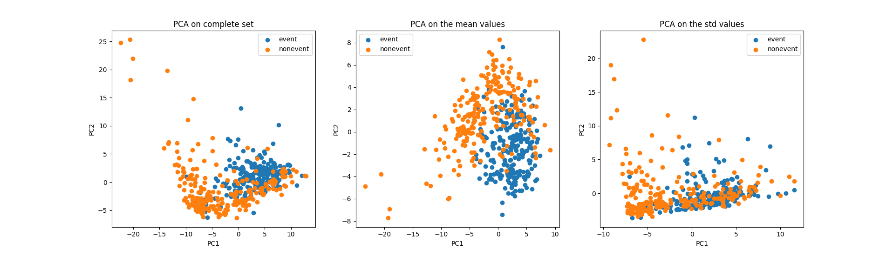
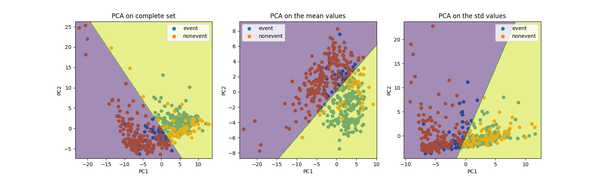
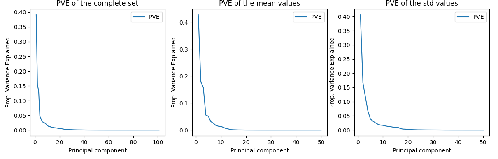
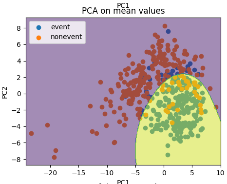
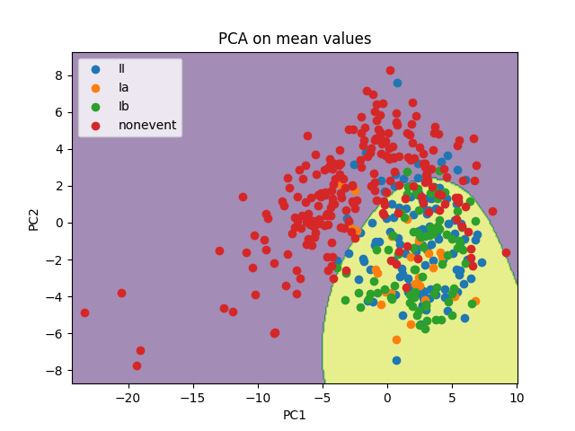

Group: Samuel Axberg
## Introduction
My initial goal was to first build a working binary calssifier for nonevent vs event and then in the next stage classify the specific events (II, Ia and Ib). I was curious how the means and standard deviations in the data set contributed separately, so I decided to perform data analysis on the complete set, the means and the stds separately. All features were normalized to zero mean and unit variance prior to analysis.

## Data analysis

I had previously realized that when performing principal component analysis (PCA) on the training data, the nonevent observations formed a noticable separation from the events. This inspired me to explore further using PCA.



I plotted out the observations colored by their values on class2, or in other words, blue indicates an event and orange nonevent. I began by making a binary classifier, so decided to keep the plots simple. The plots were done on the first two components of each PCA, resulting in three plots. There is a noticable separation between the classes and it seems it is the largest in the means plot. 

## Binary classification

To confirm whether my observation held true I decided to fit a logistic regression model on each of the PCA sets utilizing the first two components and performing 10-fold cross validation.



In the plots above the decision boundary for logistic regression has been plotted out. It appears that logistic regression fits best in the mean value plot, where the boundary aligns pretty well with the separation. This is corraborated by the results of the tenfold cross validation:

```bash
10-fold cv on complete set: 0.7644444444444445
10-fold cv on means: 0.8355555555555556
10-fold cv on stds: 0.7177777777777778
```
With tenfold cross validation it is clear that logistic regression fits best to the principal components produced by the mean values, which indicates that the mean values provide the best separation between event and nonevent.

### Selecting the number of Principal Components

Until now I had only used the first two principal components, so next I calculated the proportional variance explained (PVE) in order to find the optimal number of components. I plotted out the PVE as a function of the number of components.



From the plotted PVE I can observe an elbow at around the fourth principal component. For this reason I decided to try logistic regression on the four first principal components.

```bash
10-fold cv on complete set (2 first PC): 0.7644444444444445
10-fold cv on complete set (4 first PC): 0.8533333333333333
10-fold cv on means (2 first PC): 0.8355555555555556
10-fold cv on means (4 first PC): 0.8733333333333334
10-fold cv on stds (2 first PC): 0.7177777777777778
10-fold cv on stds (4 first PC): 0.8288888888888888
```

While the complete set and stds experience an larger increase in accuracy compared to the means set, they are still outperformed by the means.

### Nonlinear models

Logistic regression results in a linear decision boundary, but in the two component plot there is a clearly non-linear pattern for the nonevents. With a support vector classifier a non linear decision boundary can be created, so I decided to try it out.



```bash
10-fold cv on mean values with SVC (4 first PC): 0.8755555555555556
```

The boundary is now more curved and while the accuracy did not improve too much, there was still a slight improvement.

## Multiclass classification

With a working binary classifier for nonevent vs event in hand I created a baseline or "dummy" model for predicitng the specific events. The dummy chooses the most common event type out of II, Ia and Ib. Up until now the accuracy scores have been for the binary classification of nonevent vs event, but from here on they will evaluate the accuracy of all four classes and therefore be lower.

```bash
10-fold cv on mean values with SVC (4 first PC): 0.6533333333333333
```

My next goal was to improve the accuracy by replacing the dummy event classifier with something better. I decided to again plot out the observtions with in a 2-dimensional PCA plot, but this time color the events individually. I did this to see if there was any clear patterns in their distribution.



In the plot above it is visible that there is more overlap between them compared to nonevent. This means that logistic regression and support vectors are not likely to perform well, atleast not on the two first components. I still tried out support vectors on four components, in case it fits better.

```bash
10-fold cv on mean values with SVC (4 first PC): 0.668888888888889
```

There was a slight improvement over the dummy classifier in four components. 

### Model selection

At this point I decided to do a proper model selection script. Although I already had a workin binary classifier I decided to implement proper model selection for both the binary classifier and the event classifier. I ended up with a script that tried all possible combinations that can be formed from the following models:
| Model | Justification |
|---|---|
| Logistic regression | A linear model that is interpretable and fast to train |
| Support Vector Classifier | Can model non-linear decision boundaries, which might work well with the non-linear pattern that could be observed in the PCA plot. |
| K-Nearest neighbour | Besides the non-linear pattern of nonevents there were what looked like clusters within the events (II, Ia, Ib), so I though KNN could work well.
| Random Forrest Classifier | Tree-based method that handles non-linear patterns well. A drawback could be that PCA does not contribute to this method. |

The script evaluated both the binary and multiclass accuracy using tenfold cross validation. Perplexity was also evaluated, which I had ignored up until now, and the combined score was calculated according to the project instructions. The following table contains the results on the .mean set.

### Mean set model selection

| class2 model | event model | Binary Accuracy | Perplexity | Multi-Class Accuracy | Combined Score |
|---|---|---|---|---|---|
| SVC | SVC | 0.88222 | 1.42939 | 0.66889 | 0.70724 |
| SVC | LR | 0.88222 | 1.42703 | 0.66222 | 0.70581 |
| SVC | KNN | 0.88222 | 1.42665 | 0.65259 | 0.70272 |
| SVC | RF | 0.88222 | 1.42646 | 0.65111 | 0.70229 |
| LR | SVC | 0.88133 | 1.42649 | 0.65333 | 0.70273 |
| LR | LR | 0.88074 | 1.42651 | 0.65259 | 0.70227 |
| LR | KNN | 0.88032 | 1.42653 | 0.64952 | 0.70110 |
| LR | RF | 0.88000 | 1.42654 | 0.64972 | 0.70106 |
| KNN | SVC | 0.87877 | 1.90152 | 0.65037 | 0.68493 |
| KNN | LR | 0.87778 | 2.28151 | 0.64956 | 0.67158 |
| KNN | KNN | 0.87697 | 2.59241 | 0.64687 | 0.65998 |
| KNN | RF | 0.87630 | 2.85149 | 0.64481 | 0.65038 |
| RF | SVC | 0.87538 | 2.76553 | 0.64581 | 0.65178 |
| RF | LR | 0.87524 | 2.67095 | 0.64619 | 0.65482 |
| RF | KNN | 0.87496 | 2.58836 | 0.64504 | 0.65712 |
| RF | RF | 0.87431 | 2.51652 | 0.64431 | 0.65894 |

From the table it is visible that SVC for both binary classification and event classification performs the best. Because I had not taken perplexity into account previously I also ran the same test on the whole dataset and .std set.

### Complete set model selection

| class2 model | event model | Binary Accuracy | Perplexity | Multi-Class Accuracy | Combined Score |
|---|---|---|---|---|---|
| SVC | SVC | 0.86000 | 1.45512 | 0.60889 | 0.67126 |
| SVC | LR | 0.86000 | 1.45452 | 0.62111 | 0.67553 |
| SVC | KNN | 0.86000 | 1.45358 | 0.62074 | 0.67572 |
| SVC | RF | 0.86000 | 1.45384 | 0.62444 | 0.67687 |
| LR | SVC | 0.85911 | 1.45326 | 0.62000 | 0.67529 |
| LR | LR | 0.85852 | 1.45287 | 0.62111 | 0.67559 |
| LR | KNN | 0.85810 | 1.45259 | 0.62000 | 0.67517 |
| LR | RF | 0.85778 | 1.45238 | 0.62056 | 0.67532 |
| KNN | SVC | 0.85704 | 1.69991 | 0.61852 | 0.65609 |
| KNN | LR | 0.85644 | 1.89793 | 0.61933 | 0.64153 |
| KNN | KNN | 0.85596 | 2.05995 | 0.61859 | 0.62914 |
| KNN | RF | 0.85556 | 2.19497 | 0.61963 | 0.61937 |
| RF | SVC | 0.85658 | 2.19184 | 0.62000 | 0.61996 |
| RF | LR | 0.85698 | 2.16938 | 0.62175 | 0.62079 |
| RF | KNN | 0.85733 | 2.17982 | 0.62207 | 0.62032 |
| RF | RF | 0.85778 | 2.18693 | 0.62264 | 0.61995 |

### Std model selection

| class2 model | event model | Binary Accuracy | Perplexity | Multi-Class Accuracy | Combined Score |
|---|---|---|---|---|---|
| SVC | SVC | 0.83333 | 1.51322 | 0.57333 | 0.63115 |
| SVC | LR | 0.83333 | 1.51371 | 0.58333 | 0.63432 |
| SVC | KNN | 0.83333 | 1.51332 | 0.58889 | 0.63630 |
| SVC | RF | 0.83333 | 1.51385 | 0.58889 | 0.63612 |
| LR | SVC | 0.83289 | 1.51841 | 0.58622 | 0.63357 |
| LR | LR | 0.83259 | 1.52146 | 0.58815 | 0.63309 |
| LR | KNN | 0.83238 | 1.52363 | 0.59016 | 0.63297 |
| LR | RF | 0.83222 | 1.52526 | 0.59083 | 0.63260 |
| KNN | SVC | 0.83259 | 1.77732 | 0.58889 | 0.62265 |
| KNN | LR | 0.83289 | 1.97896 | 0.58911 | 0.61529 |
| KNN | KNN | 0.83313 | 2.14395 | 0.59030 | 0.60960 |
| KNN | RF | 0.83333 | 2.28143 | 0.59111 | 0.60480 |
| RF | SVC | 0.83162 | 2.24551 | 0.58906 | 0.60396 |
| RF | LR | 0.83095 | 2.20330 | 0.58952 | 0.60501 |
| RF | KNN | 0.82948 | 2.17712 | 0.58919 | 0.60465 |
| RF | RF | 0.82819 | 2.15572 | 0.58778 | 0.60376 |

While the scores are clearly lower for the complete set and .std set, it is interesting that there is a difference in the best performing models. For the complete set SVC + RF performs the best and for .std SVC + KNN.

## Results
Key-insights:
- Principal component analysis reveals a non-linear seprataion boundary between nonevents and events, which is visible with as few as two components.
- The optimal number of principal components seem to be around four.
- The mean features capture the most information when using principal component analysis.
- Support vector classifier is the best option for nonevent vs event binary classification for both mean and std set.
- Classification of the indiviual events is much more difficult than the binary classification.
- Random forest classifier for the events is the best option in the complete set.
- Support vector classifier events is the best option in the mean set.
- K-nearest neighbours for the events is the best option in the std set.

I selected the SVC+SVC trained on the mean set as my submission.

## Self evaluation
I give myself a 3 for my project report.

I performed required steps of data analysis, feature selection, model selection and evaluation of my produced models. I could have gone further and done parameter tuning to on the models to get even better results, but I did not have the time. The event classification could probably also be improved a lot with perhaps a different feature selection method combined with parameter tuning the models.

I spent most of my time on the PCA and wish I started proper model selection earlier. I also had forgotten about optimizing for perplexity for a while. I had initally thought the probabilities reported in the submission were the probability of the predicted class, not realising it was supposed to be the probability of an event occurring.
