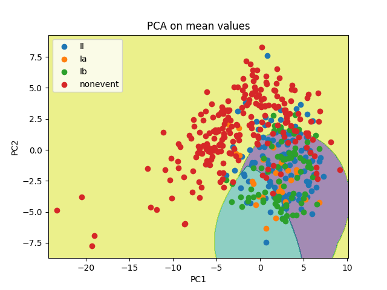
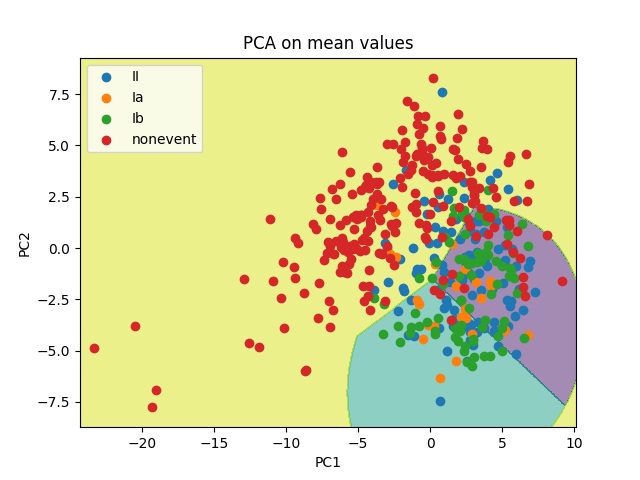

Group: Samuel Axberg

During exercise set 3 problem 20 I realized that when performing principal component analysis (PCA) on the training data, the nonevent observations formed a noticable separation from the vents. This inspired me to explore furhter using PCA. I was curious how the means and stds in the data set contributed to the prinncipal components, so I decided to perform PCA on the complete set, the means and the stds. To perform PCA the features were first normalized to have 0 mean and variance.


I plotted out the observations colored by their values on class2, or in other words, blue indicates an event and orange nonevent. I was going to begin by making a binary classifier, so keeping the plots simple did not matter at thhis point. The plots were done on the first two components of each PCA, resulting in three plots. There is a noticable separaion between the classes and it seems it is largerst in the means plot. To confirm whether my observation held true I decided to fit a logistic regression model on each of the PCA sets utilizing the first two components and performing 10-fold cross validation.


In the plots above the decision boundary for logistic regression has been plotted out. It appears that logistic regression fits best in the mean value plot, where the boundary aligns pretty well with the separation. This is corraborated by the results of the tenfold cross validation:

```bash
10-fold cv on complete set: 0.7644444444444445
10-fold cv on means: 0.8355555555555556
10-fold cv on stds: 0.7177777777777778
```
With tenfold cross validation it is clear that logistic regression fits best to the principal components produced by the mean values, which indicates that the mean values provide the best separation between event and nonevent.

This is only the first two principal components however, so next I calculated the proportional variance explained (PVE) in order to find the optimal number of components. I plotted out the PVE as a function of the number of components.


From the plotted PVE I can observe an elbow at around the fourth principal component. For this reason I decided to try logistic regression on the four first principal components.

```bash
10-fold cv on complete set (2 first PC): 0.7644444444444445
10-fold cv on complete set (4 first PC): 0.8533333333333333
10-fold cv on means (2 first PC): 0.8355555555555556
10-fold cv on means (4 first PC): 0.8733333333333334
10-fold cv on stds (2 first PC): 0.7177777777777778
10-fold cv on stds (4 first PC): 0.8288888888888888
```

While the complete set and stds experience an larger increase in accuracy compared to the means set, they are still outperformed by the means.

Logistic regression results in a linear decision boundary, but there is a clearly non-linear pattern in the nonevents. With a support vector classifier a non linear decision boundary can be created.


```bash
10-fold cv on mean values with SVC (4 first PC): 0.8755555555555556
```

The boundary is now more curved and while the accuracy did not improve too much, there was still a slight improvement.

With a working binary classifier for nonevent vs event in hand I created a baseline or "dummy" model for predicitng the specific events. The dummy chooses the most common event type out of II, Ia and Ib. Up until now the accuracy scores have been for the binary classification of nonevent vs event, but from here on they will evaluate the accuracy of all four classes and therefore be lower.

```bash
10-fold cv on mean values with SVC (4 first PC): 0.6533333333333333
```

My next goal was to improve the accuracy by replacing the dummy event classifier with something better. 


When coloring the events differently it is visible in the first two components that there is more overlap between them compared to nonevent. This means that neither logistic regression or support vectors are likely to perform well. I still tried out support vectors on four components, in case it fits better.



```bash
10-fold cv on mean values with SVC (2 first PC): 0.6066666666666667
10-fold cv on mean values with SVC (4 first PC): 0.668888888888889
```

There was a slight improvement over the dummy classifier in four components, but when looking at the PCA plot for the two first components it is clear that SVC did not fit well. Next I tried logistic regression 



```bash
10-fold cv on mean values with SVC (2 first PC): 0.6088888888888889
10-fold cv on mean values with SVC and LR (4 first PC): 0.6755555555555556
```

Logistic regression performed slightly better than SVC for the individual events (II, Ia, Ib), more so with four components.